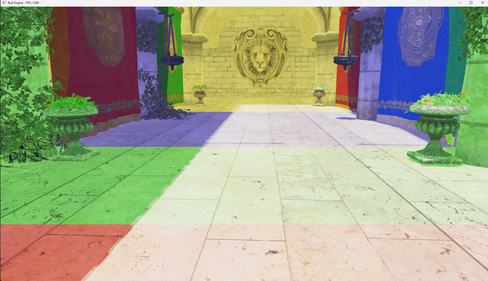
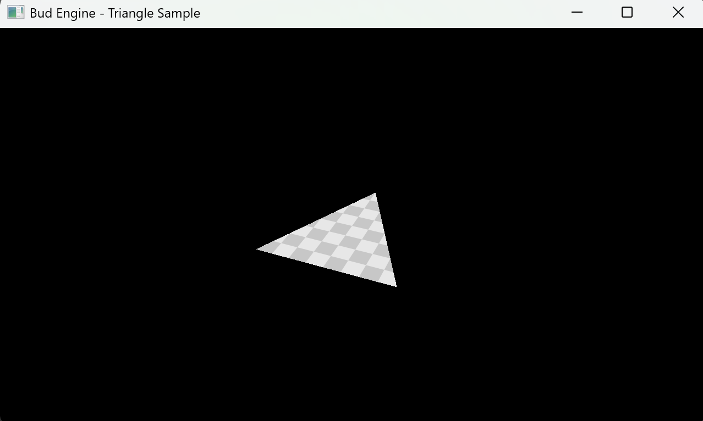
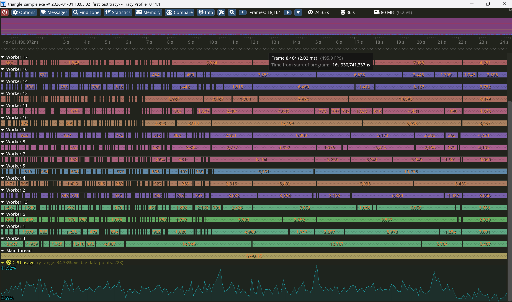

# Bud Engine
A full fiber-based task driven lightweight 3D Game Engine.

## Key Features

### Core Architecture & Stability
* **Modern C++23 Standard**: Built with the latest language features (Concepts, std::print, designated initializers) ensuring high performance and type safety.
* **Robust Architecture**: Traditional Header/Source (`.hpp`/`.cpp`) structure ensures maximum compiler compatibility and stability across MSVC/Clang/GCC.
* **Fiber-Based Task System**: A lightweight, multi-threaded job system (`TaskScheduler`) for high-performance parallel processing.
* **Game Logic Decoupling**: Application layer is separated from the core engine using dependency injection (`GameApp`), allowing the engine to run as a library.
* **Crash Handling**: Integrated **Stacktrace** for rapid debugging and stability monitoring.
* **Integrated Profiling**: Full instrumentation using **Tracy Profiler** for real-time CPU performance analysis and frame time monitoring.

### Rendering & Vulkan Backend
* **Physically Based Rendering (PBR)**: Implemented standard Cook-Torrance BRDF lighting model for realistic material rendering.
* **RHI (Render Hardware Interface)**: Backend-agnostic graphics abstraction layer using the Factory Pattern, currently supporting **Vulkan**.
* **Advanced Shadowing**: **Cascaded Shadow Maps (CSM)** with PCF (Percentage-Closer Filtering), customized partition logic (Log-Linear Split), and distance-based culling for large-scale scenes.
* **Render Graph**: Automatic resource barrier management, pass reordering, and transient memory aliasing.
* **Texture Management**: 
    * **Automatic Mipmap Generation**: Runtime generation of mip chain using `vkCmdBlitImage` for optimal texture sampling quality.
    * **Descriptor Indexing**: Bindless-style texture management using partially bound descriptor arrays (`runtimeDescriptorArray`).
* **Parallel Command Recording**: Multithreaded generation of secondary command buffers for high-efficiency draw calls.
* **Double-Buffered Rendering**: Robust CPU-GPU synchronization (`MAX_FRAMES_IN_FLIGHT = 2`) using Fences and Semaphores.
* **Asynchronous Asset Loading**: Non-blocking loading pipelines for Meshes (OBJ) and Textures to prevent frame stalls.
* **Hot-Reloading**: Runtime shader recompilation and pipeline state reconstruction.

### Memory Management
* **Staging Ring Buffer**: Persistent mapped memory for high-frequency dynamic data uploads (Double Buffering).
* **Fine-grained Sub-allocation**: Page-based GPU memory allocator supporting both Linear (Transient) and FreeList (Static) strategies.
* **Resource Pooling**: Logical pooling of Vulkan objects (Images/Buffers) to minimize driver overhead during Render Graph execution.

## Planned Features

* **Scene Management & Acceleration**:
    * **Spatial Partitioning**: Implement dynamic **BVH** construction on CPU for efficient scene queries.
    * **Data-Oriented Design (DOD)**: ECS-based scene memory layout for cache coherence.

* **Pipeline & Rendering**:
    * **GPU-Driven Rendering**: 
        * **Culling Architecture**: **LBVH (Linear BVH)** traversal and **Hi-Z** occlusion culling.
        * **Dual-Pipeline Support**: Designed to support both standard **Compute Shader** (Indirect Draw) and modern **Mesh Shader** (Task Shader amplification) workflows.
    * **Advanced Shading**: Forward+ or Deferred Shading.

* **Memory Management**: 
    * **Virtual Texture Streaming**: Sparse binding support for massive textures.

CSM Shadow


PBR and PCF Shadow


Mipmaps



Performance tracing tool's test 



# Note

- If you use Visual Studio/VSCode with open folder to work, please add following configs into lauch.vs.json file.
```  json
"currentDir": "${workspaceRoot}"  
```
