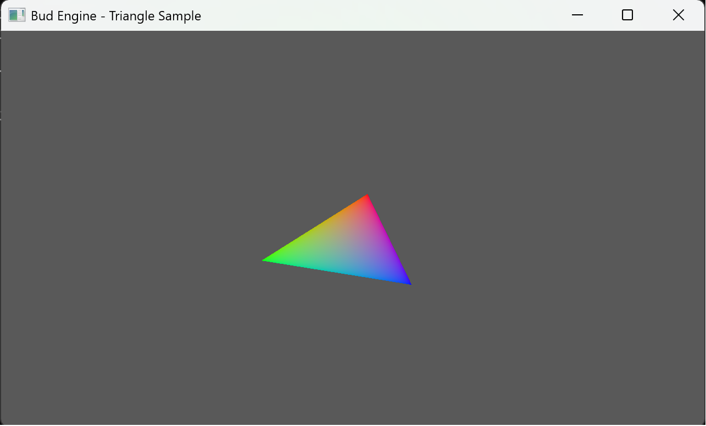
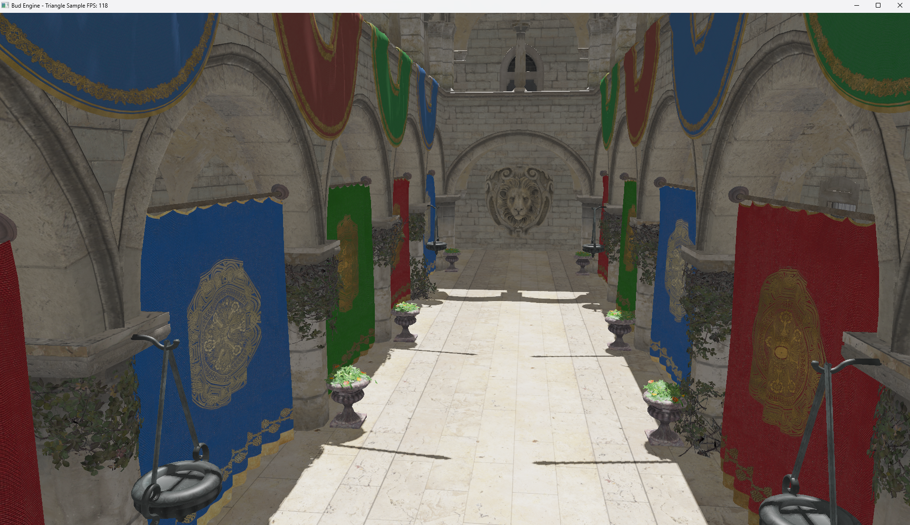

         


# Bud Engine
A full fiber-based task driven lightweight 3D Game Engine.

Hello world  


Hello mipmaps


Hello PBR


Hello Shadow


Performance tracing tool's test 


## 构建说明

### 依赖管理

### 快速开始

### 详细配置

### 项目结构

### 常见问题


# Note

- Do git submodule update --init --recursive after cloning this repository.  
- If you use Visual Studio/VSCode with open folder to work, please add following configs into lauch.vs.json file.
```  json
"currentDir": "${workspaceRoot}"  
```
