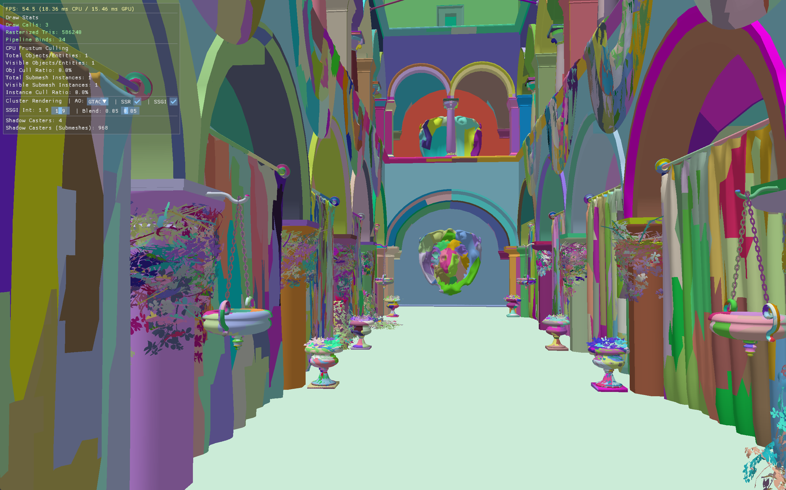
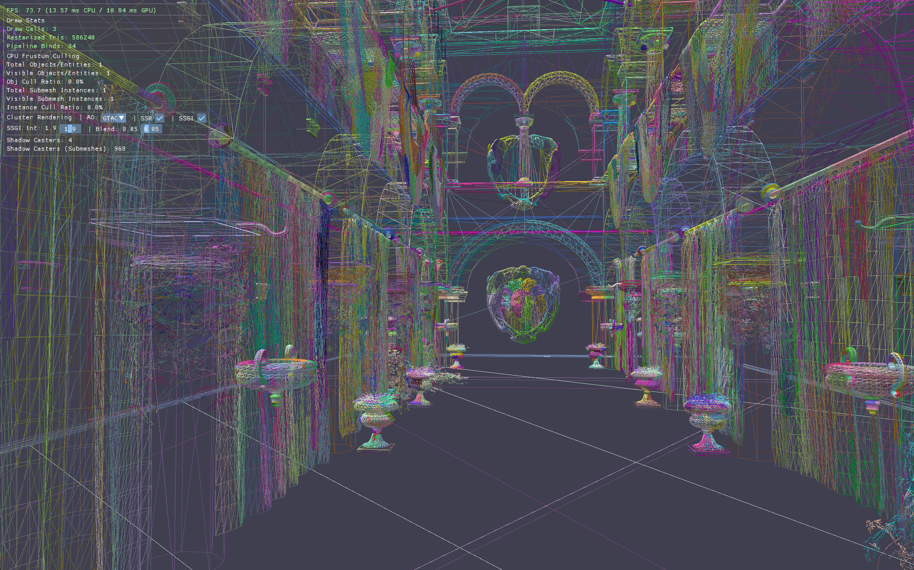
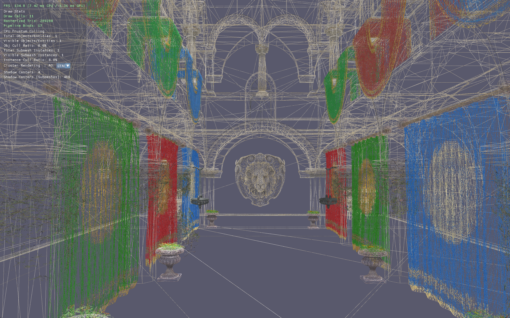
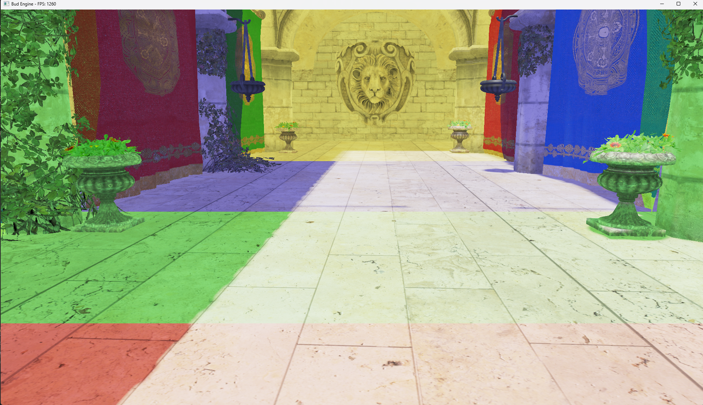

# Bud Engine
A full fiber-based task driven lightweight 3D Game Engine.

## Key Features

### Core Architecture & Stability
* **Modern C++23 Standard**: Built with the latest language features (Concepts, std::print, designated initializers, user-defined literals `_cm`, `_m`, `_mm`, `_s`, `_mps`) ensuring high performance, type safety, and physical unit consistency (`1.0f Unit = 1.0 cm`).
* **Robust Architecture**: Traditional Header/Source (`.hpp`/`.cpp`) structure ensures maximum compiler compatibility and stability across MSVC/Clang/GCC.
* **Fiber-Based Task System**: A lightweight, multi-threaded job system (`TaskScheduler`) for high-performance parallel processing.
  * *Why Fibers (Stackful Coroutines) over C++20 Stackless Coroutines?* In game engine architecture, tasks often need to yield execution from deep within complex, traditional C++ call stacks (e.g., waiting for physics constraints or asset loads inside nested functions). Stackless coroutines suffer from the "function color" problem, forcing every function in the chain to explicitly become a coroutine (`co_await`), which is highly invasive. Fibers allow transparent, arbitrary-depth suspension and full call-stack preservation, making them far more suitable for integrating large game subsystems and third-party libraries without polluting the codebase.
* **Game Logic Decoupling**: Application layer is separated from the core engine using dependency injection (`GameApp`), allowing the engine to run as a library.
* **Crash Handling**: Integrated **Stacktrace** for rapid debugging and stability monitoring.
* **Integrated Profiling & GPU Debugging**: 
    * Full instrumentation using **Tracy Profiler** for real-time CPU performance analysis and frame time monitoring.
    * Integrated **NVIDIA Nsight Aftermath** for capturing and analyzing GPU crash dumps (TDRs) and resolving device lost errors.
    * Robust **RenderDoc** compatibility achieved through thread affinity mechanisms, ensuring stable frame captures and precise API-level debugging.

### Rendering & Vulkan Backend
* **Unified Visibility Buffer Architecture**: Standard modern geometry-shading decoupling pipeline:
    * **Dual Virtual Geometry Rasterization Paths**:
        * **Modern Mesh Shader Path**: Native Vulkan Task and Mesh Shader amplification (`visibility.task` + `visibility.mesh` via `VK_EXT_mesh_shader`).
        * **Compute Indirect Path**: GPU-driven cluster culling and MultiDrawIndirect rasterization (`page_emit.comp` + `cluster_cull.comp` + `visibility_indirect.vert/frag`).
    * **Full-Screen Resolve Pass**: High-efficiency deferred material evaluation, decoding Cluster ID, Material ID, Screen Depth, UV, and Normal from `VisibilityBuffer (RGBA32_UINT)` to evaluate PBR lighting, GTAO/SSAO, and CSM shadows.
* **Physically Based Rendering (PBR)**: Implemented standard Cook-Torrance BRDF lighting model for realistic material rendering.
* **RHI (Render Hardware Interface)**: Backend-agnostic graphics abstraction layer using the Factory Pattern, currently supporting **Vulkan**.
* **GPU-Driven Virtual Geometry Traversal & Culling**:
    * **GPU Hierarchy DAG Traversal (`HierarchyTraversalPass`)**: Top-down DAG LOD traversal on GPU (`hierarchy_traversal.comp`) with screen-space projected pixel error metric, cone culling, frustum culling, and dithered LOD blending.
    * **Two-Stage Hierarchical Culling**: Broad-phase instance culling combined with fine-grained cluster frustum and Hi-Z occlusion culling.
    * **RL-Driven Concurrent Hi-Z Occlusion Culling**: Reinforcement learning (`ml_perception`) occluder heuristic selection for zero-latency current-frame Z-Prepass and Hi-Z pyramid generation.
* **Virtual Geometry & Page Streaming**:
    * **Virtual Memory Paging for GPU Geometry**: Large scenes are sliced into uniform 128KB memory pages (`bud::asset::VG_PAGE_SIZE = 131,040 Bytes`) and streamed asynchronously (`StreamingManager`) via non-blocking `bud::io` operations.
    * **Bindless Slot-Based Page Pool & Page Table**: Global GPU storage buffer partitioned into 128KB slots with an indirect SSBO Page Table (`valid` / `pool_offset`), allowing zero-rebind single-buffer rendering across disjoint pages.
    * **Compact Geometry Packing**: 12-bit quantized position streams, packed snorm8 normals/tangents, and half-float UVs for maximum bandwidth efficiency.
* **Refactored Asset Pipeline (`BudAssetCompiler` & `BudAssetImporter`)**:
    * Dedicated modular toolchain for clusterization (`meshoptimizer`), hierarchical DAG reduction, METIS-based cluster grouping, and uniform 128KB binary page baking.
    * Unified `.budasset` container format with typed chunk tables for Virtual Geometry (`AssetChunkType::VirtualGeometry`), Runtime Materials, and Textures.
* **Advanced Shadowing**: **Cascaded Shadow Maps (CSM)** with PCF (Percentage-Closer Filtering), customized partition logic (Log-Linear Split), and distance-based culling for large-scale scenes.
* **Ambient Occlusion Pipeline**: Comprehensive screen-space ambient occlusion supporting **GTAO** (Ground Truth Ambient Occlusion) and **SSAO**, temporal accumulation (`AOTemporalPass`), and depth-aware spatial filtering (`AOBlurPass`).
* **Render Graph**: Automatic resource barrier management, pass reordering, and transient memory aliasing.
* **Texture Management**: 
    * **Automatic Mipmap Generation**: Runtime generation of mip chain using `vkCmdBlitImage` for optimal texture sampling quality.
    * **Descriptor Indexing**: Bindless-style texture management using partially bound descriptor arrays (`runtimeDescriptorArray`).
* **Parallel Command Recording**: Multithreaded generation of secondary command buffers for high-efficiency draw calls.
* **Multiple-Buffered Rendering**: Robust CPU-GPU synchronization (`MAX_FRAMES_IN_FLIGHT = 3`) using Fences and Semaphores.
* **Asynchronous Asset Loading**: Non-blocking loading pipelines for Meshes (OBJ), glTF scenes, and Textures via `bud::io` to prevent frame stalls.
* **Hot-Reloading**: Runtime shader recompilation and pipeline state reconstruction.

### Memory Management
* **Staging Ring Buffer**: Persistent mapped memory for high-frequency dynamic data uploads (Double Buffering).
* **Fine-grained Sub-allocation**: Page-based GPU memory allocator supporting both Linear (Transient) and FreeList (Static) strategies.
* **Resource Pooling**: Logical pooling of Vulkan objects (Images/Buffers) to minimize driver overhead during Render Graph execution.
* **Virtual Geometry Page Pool**: Slot-based 128KB GPU Page Pool buffer with indirect page-table addressing (`PageTableBuffer`) for scalable geometry streaming.

## Planned Features

* **Pipeline & Rendering**:
    * **Multi-View VG Shadows**: Cascaded Shadow Maps (CSM) pure depth Task/Mesh and Indirect VG rasterization with orthogonal projection error metric.
    * **Cluster Hi-Z Occlusion Culling**: DAG Root Group Coarse LOD depth prepass and Nanite-style Two-Phase occlusion feedback loop.
    * **Advanced Shading**: Clustered Forward+ and volumetric lighting.
    * **Neural Rendering (In Progress)**: AI denoise pass and neural super-resolution from low-res `color/depth/motion vectors` running via compute inference.

* **Memory & Streaming**: 
    * **Virtual Texture Streaming**: Sparse binding support for massive textures.

Cluster Visualization

Cluster Wireframe Visualization

Wireframe Debug

CSM Debug

