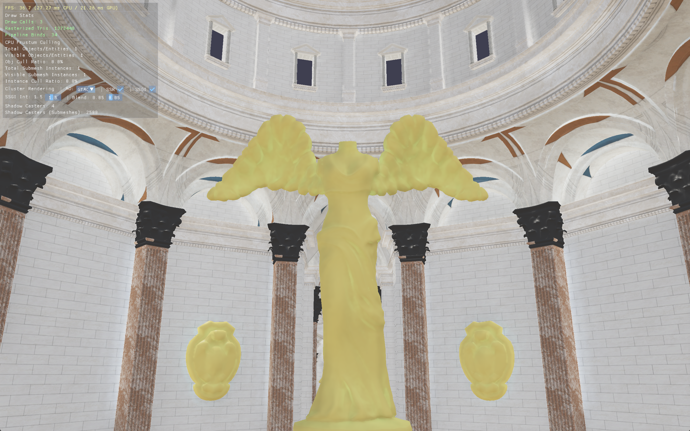
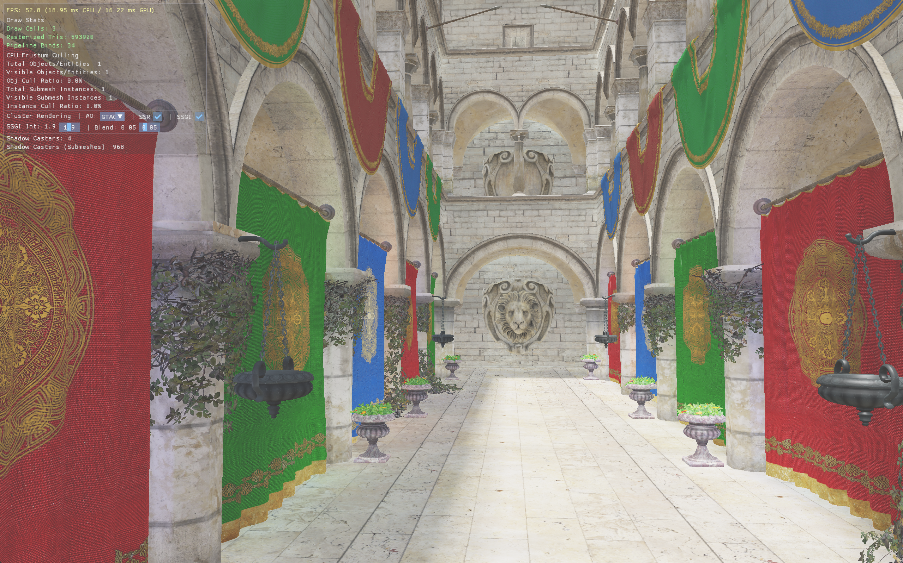

# Bud Engine

A fiber-based task-driven lightweight 3D game engine with Nanite-style GPU-driven Virtual Geometry, Reversed-Z depth, and modern Vulkan rendering pipeline.

---

## Features

### Virtual Geometry (Nanite-Style)

* **Dual Rasterization Paths**: Vulkan Mesh Shaders (`VK_EXT_mesh_shader`) and Compute Indirect MultiDraw fallback.
* **100% GPU-Driven Pipeline**: Virtual Geometry bypasses CPU culling; GPU instance frustum culling, DAG LOD selection, and two-phase Hi-Z occlusion culling execute entirely on the GPU.
* **Dual-Track Culling Architecture**: GPU-driven pipeline for Virtual Geometry alongside hybrid CPU BVH + GPU occlusion culling for traditional meshes.
* **Cluster DAG LOD Selection**: Hierarchical cluster tree traversal with projected screen-space error metrics for camera and shadow views.
* **Page-Based Streaming & Bindless Memory**: Asynchronous 128KB page streaming and global GPU storage buffer pool with bindless page table indexing.

---

### Rendering Pipeline

* **Visibility Buffer Deferred Shading**: Decoupled geometry rasterization and fullscreen material shading pass.
* **Reversed-Z Floating-Point Depth**: High-precision depth testing eliminating distant Z-fighting.
* **Physically Based Rendering (PBR)**: Cook-Torrance BRDF with hemispheric ambient and emissive lighting.
* **Cascaded Shadow Maps (CSM)**: 4-cascade shadow maps with rotation-invariant spherical distance selection, PCF filtering, and direct cluster shadow rasterization.
* **Screen-Space Effects**: Screen-Space Reflections (SSR), Screen-Space Global Illumination (SSGI), and Ground Truth Ambient Occlusion (GTAO / SSAO).
* **Tone Mapping**: ACES filmic tonemapping and sRGB color workflow.

---

### Core Architecture

* **Modern C++23**: Concepts, designated initializers, `std::print`, and physical unit literals.
* **Fiber-Based Task System**: Multi-threaded job scheduler using stackful fibers for transparent, arbitrary-depth yielding.
* **Multi-Queue Vulkan RHI**: Independent Graphics, Async Compute, and DMA Transfer queues synchronized via timeline semaphores.
* **Asynchronous I/O Subsystem**: Non-blocking runtime file streaming and asset loading.
* **Dependency Injection**: Explicit system lifetimes without global singletons.
* **Diagnostics & Profiling**: Tracy CPU profiler, NVIDIA Nsight Aftermath crash dump integration, and RenderDoc capture support.

---

### Physics System

* **Jolt Physics Integration**: Real-time rigid body dynamics simulation.
* **Collision Detection**: Support for Box, Sphere, Capsule, Convex Hull, and Mesh shapes.
* **Scene Queries**: Raycasting and shape casting through broad-phase and narrow-phase acceleration structures.
* **Debug Visualizer**: In-engine line rendering for collision volumes and bounding boxes.

---

### Machine Learning & RL

* **Reinforcement Learning Environment**: Standardized environment abstraction with observation encoding and action decoding.
* **Python Bindings (`bud_rl`)**: Interoperability with external Python RL frameworks via PyBind11.

---

### Asset Pipeline & Tools

* **Model Importers**: High-performance loaders for FBX, glTF 2.0, and OBJ.
* **Virtual Geometry Baking**: Offline cluster partitioning, METIS graph grouping, and DAG LOD hierarchy generation.
* **Texture Processing**: BC1-BC7 block decompression, companion alpha mask merging, and mipmap generation.
* **CLI Tools**: `BudAssetCompiler`, `BudAssetImporter`, and `SceneTool`.

---

## Showcase

### Sun Temple (Virtual Geometry + SSGI + SSR + CSM)

### Virtual Geometry Cluster Debug Visualization

### Virtual Geometry Cluster Wireframe View

### Cascaded Shadow Maps (CSM) Debug Overlay

### Physically Based Shading + SSR + SSGI

