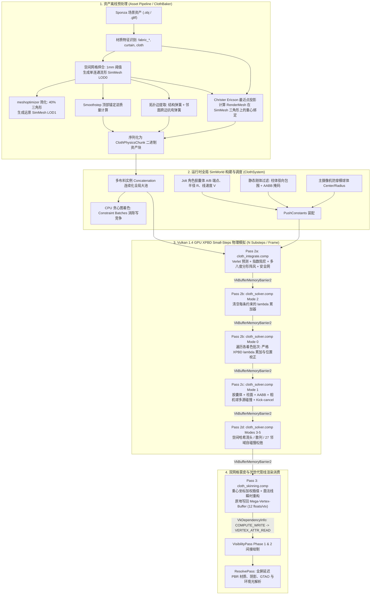

# BudEngine GPU XPBD 布料物理与角色交互技术规范 (Vulkan 1.4 完整实现版)
> **Document Status**: `[PRODUCTION SPECIFICATION - VULKAN 1.4]`  
> **Target Subsystem**: `bud::physics::ClothSystem`, `bud::graphics::Renderer`, `bud_asset_compiler`  
> **API & Hardware**: Vulkan 1.4 (SPIR-V Compute Shader), Multi-Vendor GPU Native (NVIDIA / AMD / Intel)  
> **Corresponding Word Doc**: [doc/BudEngine_GPU_XPBD_Cloth_Simulation.docx](file:///d:/PersonalProjects/BudEngine/doc/BudEngine_GPU_XPBD_Cloth_Simulation.docx)

---

## 概述与设计演进背景

本文档是 BudEngine 物理系统关于 **GPU XPBD 双网格布料与第一人称角色交互** 的完整生产技术规范与架构文档。

原方案作为前期理论设计蓝图（Blueprint），在经过实际工程落地以及近期两个核心架构变更后，已由当前高度成熟、经过严格真机调优的代码体系全面取代：
1. **commit `a576c28` (`feat(physics): implement cloth self-collision via spatial hash grid`)**：实现了完全基于 GPU 的空间哈希网格自碰撞，彻底杜绝了布料折叠穿模与自激抽搐；
2. **commit `29757c8` (`feat(ui, physics): refine directional light controls, drag isolation, and cloth collider setup`)**：完善了静态场景刚体 AABB 最小穿透轴推离、廊柱 XZ 径向投影推离、Rest-embed 初始嵌套掩码、主相机防穿模球体，以及动态光照与 UI 调试的完全隔离。

底层图形与计算 API 实际基于最新的 **Vulkan 1.4** 规范（Vulkan SDK 1.4.335.0），深度依赖 `VkBufferMemoryBarrier2` 显存屏障模型与异步计算队列，贯彻 **0 CPU 回读、0 PCIe 冗余带宽传输** 的完全 GPU 计算闭环设计。

---

## 1. 工业级双网格与全局池化架构时序

系统贯彻物理仿真流形拓扑（SimMesh）与材质渲染拓扑（RenderMesh）解耦的工业标准，并在 Vulkan 1.4 运行时执行全场景池化与图着色并行优化：

- **1.1 离线双网格解耦与流形焊合 (LOD0 & LOD1)**：
  在 [src/tools/asset_pipeline/builders/cloth_baker.cpp](file:///d:/PersonalProjects/BudEngine/src/tools/asset_pipeline/builders/cloth_baker.cpp) 中，以 1mm 空间网格焊合接缝顶点生成单连通流形 SimMesh LOD0，并基于 `meshoptimizer` 离线减面生成 40% 三角形的 LOD1。
- **1.2 全局池化连接 (SimWorld Concatenation)**：
  全场景所有布料实例打平拼接为一个全局粒子、约束与蒙皮绑定连续缓冲池，单帧布料模拟开销被压制为极少次数的全局 Dispatch。
- **1.3 贪心图着色并行 Gauss-Seidel**：
  CPU 端在构建期对全部距离约束执行贪心图着色，划分为互不共享粒子的约束颜色批次（Constraint Batches），在 GPU 上实现严格无数据竞争、无锁的并行 Gauss-Seidel 求解。
- **1.4 Small-Steps 小步长循环 (Macklin et al. 2019)**：
  摒弃传统单步长高迭代导致的能量积累与高频震荡（vertical bobbing），将单帧拆分为 $N$ 个独立子步（$N = 6 \sim 12$），每步独立执行外力预测、累加拉格朗日乘子重置、图着色约束松弛、多源碰撞与自碰撞。
- **1.5 多层次多源解析与离散碰撞体系**：
  包含角色胶囊体 SDF 投影与 PBD 库仑动摩擦、纤细立柱 XZ 径向投影、静态场景 AABB 最小穿透轴推离（配合 Rest-embed 掩码）、摄像机防穿模碰撞球，以及全碰撞 Kick-cancel 伪动能消除。
- **1.6 空间哈希布料自碰撞 (Spatial Hash Self-Collision)**：
  GPU 动态构建空间哈希网格，利用原子链表实现 $O(N)$ 的 27 邻域粒子间厚度推离，彻底杜绝折叠布料穿模透光。
- **1.7 原地双网格蒙皮回写**：
  求解完成后通过重心坐标插值，原地重构平滑法线并直接写回 GPUScene Mega-Vertex-Buffer（12 floats / 48 字节），通过 Vulkan 1.4 的 `vkCmdPipelineBarrier2` 无缝切入 VisibilityPass Phase 1 & Phase 2 消费。

### 架构数据流转全景流程图 (Mermaid)



---

## 2. 核心数理模型与严密力学公式推导

### 2.1 变分原理与严格 XPBD 连续介质本构推导

XPBD（Extended Position Based Dynamics）的本质是隐式时间积分下受约束连续介质弹性势能的变分泛函极小化。对于离散粒子坐标向量 $\mathbf{x} = [\mathbf{x}_1^T, \mathbf{x}_2^T, \dots, \mathbf{x}_N^T]^T$ 与约束向量方程 $\mathbf{C}(\mathbf{x}) = \mathbf{0}$，系统的离散动力学变分作用量泛函为：

$$
E(\mathbf{x}) = \frac{1}{2} (\mathbf{x} - \tilde{\mathbf{x}})^T \mathbf{M} (\mathbf{x} - \tilde{\mathbf{x}}) + U(\mathbf{x})
$$

其中弹性势能 $U(\mathbf{x})$ 由约束集合与材料逆顺应度张量 $\boldsymbol{\alpha}^{-1}$ 定义：

$$
U(\mathbf{x}) = \frac{1}{2} \mathbf{C}(\mathbf{x})^T \boldsymbol{\alpha}^{-1} \mathbf{C}(\mathbf{x})
$$

引入离散拉格朗日乘子向量 $\boldsymbol{\lambda}$，构造扩展拉格朗日目标函数（引入时间步长缩放的有效顺应度 $\tilde{\boldsymbol{\alpha}} = \boldsymbol{\alpha} / \Delta t^2$）：

$$
\mathcal{L}(\mathbf{x}, \boldsymbol{\lambda}) = \frac{1}{2} (\mathbf{x} - \tilde{\mathbf{x}})^T \mathbf{M} (\mathbf{x} - \tilde{\mathbf{x}}) + \mathbf{C}(\mathbf{x})^T \boldsymbol{\lambda} + \frac{1}{2} \boldsymbol{\lambda}^T \tilde{\boldsymbol{\alpha}} \boldsymbol{\lambda}
$$

对坐标 $\mathbf{x}$ 与乘子 $\boldsymbol{\lambda}$ 分别求一阶极值条件（KKT 条件）：

$$
\frac{\partial \mathcal{L}}{\partial \mathbf{x}} = \mathbf{M} (\mathbf{x} - \tilde{\mathbf{x}}) + \nabla \mathbf{C}(\mathbf{x}) \boldsymbol{\lambda} = \mathbf{0} \implies \mathbf{x} = \tilde{\mathbf{x}} - \mathbf{M}^{-1} \nabla \mathbf{C}(\mathbf{x}) \boldsymbol{\lambda}
$$

$$
\frac{\partial \mathcal{L}}{\partial \boldsymbol{\lambda}} = \mathbf{C}(\mathbf{x}) + \tilde{\boldsymbol{\alpha}} \boldsymbol{\lambda} = \mathbf{0}
$$

在一阶泰勒展开下线性化约束方程 $\mathbf{C}(\mathbf{x} + \Delta \mathbf{x}) \approx \mathbf{C}(\mathbf{x}) + \nabla \mathbf{C}(\mathbf{x})^T \Delta \mathbf{x} = \mathbf{0}$，代入位置位移方程导出单约束严格乘子增量闭式解：

$$
\Delta \lambda = \frac{-C(\mathbf{x}) - \tilde{\alpha} \lambda_{\text{total}}}{\nabla C(\mathbf{x})^T \mathbf{M}^{-1} \nabla C(\mathbf{x}) + \tilde{\alpha}}
$$

总拉格朗日乘子累加更新（保证材料顺应度严格解耦于迭代次数和时间步长）：

$$
\lambda_{\text{total}} \leftarrow \lambda_{\text{total}} + \Delta \lambda
$$

粒子位置解析校正向量：

$$
\Delta \mathbf{x} = \mathbf{M}^{-1} \nabla C(\mathbf{x}) \Delta \lambda
$$

---

### 2.2 结构拉伸与跨边抗弯弹簧解析梯度

两点几何距离约束函数方程：

$$
C(\mathbf{x}_1, \mathbf{x}_2) = \|\mathbf{x}_1 - \mathbf{x}_2\| - L_0
$$

约束相对质点 1 与质点 2 的解析梯度向量：

$$
\nabla_{\mathbf{x}_1} C = \frac{\mathbf{x}_1 - \mathbf{x}_2}{\|\mathbf{x}_1 - \mathbf{x}_2\|} = \mathbf{n}_{12}, \quad \nabla_{\mathbf{x}_2} C = -\frac{\mathbf{x}_1 - \mathbf{x}_2}{\|\mathbf{x}_1 - \mathbf{x}_2\|} = -\mathbf{n}_{12}
$$

代入粒子逆质量 $w_1 = 1/m_1, w_2 = 1/m_2$，分母解析二次型：

$$
\nabla C^T \mathbf{M}^{-1} \nabla C = w_1 \|\mathbf{n}_{12}\|^2 + w_2 \|-\mathbf{n}_{12}\|^2 = w_1 + w_2
$$

两点 XPBD 乘子增量与对称位置校正闭式解：

$$
\Delta \lambda = \frac{-(\|\mathbf{x}_1 - \mathbf{x}_2\| - L_0) - \tilde{\alpha} \lambda_{\text{total}}}{(w_1 + w_2) + \tilde{\alpha}}
$$

$$
\Delta \mathbf{x}_1 = +\frac{\mathbf{x}_1 - \mathbf{x}_2}{\|\mathbf{x}_1 - \mathbf{x}_2\|} (w_1 \Delta \lambda), \quad \Delta \mathbf{x}_2 = -\frac{\mathbf{x}_1 - \mathbf{x}_2}{\|\mathbf{x}_1 - \mathbf{x}_2\|} (w_2 \Delta \lambda)
$$

> **顺应度分配参数**：
> - 结构拉伸弹簧：$k_{\text{struct}} = 1.0 \times 10^{-4}\,\text{m/N}$
> - 跨边抗弯弹簧：$k_{\text{bend}} = 5.0 \times 10^{-3}\,\text{m/N}$（比拉伸软 50 倍，赋予自然悬垂感）。

---

### 2.3 时间一致性指数连续阻尼与显式小步长位置预测

连续线性粘性阻尼微分方程：

$$
\frac{d\mathbf{v}}{dt} = -\gamma \mathbf{v} \implies \mathbf{v}(t + \Delta t) = \mathbf{v}(t) e^{-\gamma \Delta t}
$$

设基准 $f_{\text{ref}} = 60\,\text{Hz}$ 帧率下的每帧损耗参数为 $d_{\text{frame}} \in [0, 1)$，连续阻尼系数 $\gamma$ 解析推导为：

$$
\gamma = -60.0 \ln(1.0 - d_{\text{frame}})
$$

任意子步时间 $\Delta t_{\text{safe}}$ 下的速度保留衰减乘子（杜绝子步连乘过阻尼）：

$$
k_{\text{ret}} = e^{-\gamma \cdot \Delta t_{\text{safe}}} = (1.0 - d_{\text{frame}})^{60.0 \cdot \Delta t_{\text{safe}}}
$$

Verlet 阻尼速度提取与显式外力积分预测下一子步未约束坐标 $\tilde{\mathbf{x}}$：

$$
\mathbf{v} = \left( \frac{\mathbf{x}_{\text{cur}} - \mathbf{x}_{\text{prev}}}{\Delta t_{\text{safe}}} \right) k_{\text{ret}}
$$

$$
\tilde{\mathbf{x}} = \mathbf{x}_{\text{cur}} + \mathbf{v} \Delta t_{\text{safe}} + \mathbf{a}_{\text{total}} (\Delta t_{\text{safe}})^2, \quad \mathbf{x}_{\text{prev}} \leftarrow \mathbf{x}_{\text{cur}}
$$

---

### 2.4 多八度有机阵风场与相对气动力学积分

三组空间正弦八度波叠加：

$$
g_1 = \sin(0.60 t + 0.15 x + 0.10 z), \quad g_2 = \sin(0.95 t + 1.35), \quad g_3 = \sin(1.30 t + 0.25 x)
$$

三次方埃尔米特光滑过渡阵风包络：

$$
u = \text{clamp}(0.35 + 0.35 g_1 + 0.20 g_2 + 0.10 g_3, 0.0, 1.0), \quad \text{gust} = u^2 (3.0 - 2.0 u)
$$

瞬时风速标量与垂直高度遮蔽衰减函数：

$$
v_{\text{wind}} = v_{\text{strength}} (0.30 + 0.70 \cdot \text{gust}), \quad f_{\text{height}} = \text{clamp}(\max(0.0, y_{\text{top}} - y_{\text{cur}}) \cdot 0.35, 0.05, 1.0)
$$

横向侧风涟漪颤振（Lateral Flutter）：

$$
\mathbf{d}_{\text{side}} = \frac{\mathbf{d}_{\text{wind}} \times \mathbf{u}_y}{\|\mathbf{d}_{\text{wind}} \times \mathbf{u}_y\|}, \quad \text{flutter} = \sin(2.40 t + 0.50 x + 0.50 z) \cdot 0.22
$$

环境风矢量与总外力场加速度矢量：

$$
\mathbf{v}_{\text{wind}} = (\mathbf{d}_{\text{wind}} + \mathbf{d}_{\text{side}} \cdot \text{flutter}) (v_{\text{wind}} \cdot f_{\text{height}})
$$

$$
\mathbf{a}_{\text{aero}} = (\mathbf{v}_{\text{wind}} - \mathbf{v}) \cdot c_{\text{drag}}, \quad \mathbf{a}_{\text{total}} = \mathbf{g} + \mathbf{a}_{\text{aero}} \cdot w
$$

---

### 2.5 解析碰撞力学、库仑动摩擦与 Kick-Cancel 动能消除

胶囊体轴线段 $\mathbf{A} \to \mathbf{B}$（线段向量 $\mathbf{u} = \mathbf{B} - \mathbf{A}$，粒子相对位移 $\mathbf{d} = \mathbf{x} - \mathbf{A}$），轴线投影参数：

$$
t_{\text{proj}} = \text{clamp}\left( \frac{\mathbf{d} \cdot \mathbf{u}}{\|\mathbf{u}\|^2}, 0.0, 1.0 \right)
$$

轴线最近点 $\mathbf{q}$ 与单位外法向 $\mathbf{n}$：

$$
\mathbf{q} = \mathbf{A} + t_{\text{proj}} (\mathbf{B} - \mathbf{A}), \quad \mathbf{n} = \frac{\mathbf{x} - \mathbf{q}}{\|\mathbf{x} - \mathbf{q}\|}
$$

当 $\|\mathbf{x} - \mathbf{q}\| < (R + 0.03\text{m})$ 时沿外法向推离至安全表面：

$$
\mathbf{x}_{\text{projected}} = \mathbf{q} + \mathbf{n} (R + 0.03)
$$

粒子与刚体表面相对速度分解（法向分量 $v_n$ 与切向分量 $\mathbf{v}_t$）：

$$
\mathbf{v}_{\text{rel}} = \frac{\mathbf{x}_{\text{projected}} - \mathbf{x}_{\text{prev}}}{\Delta t} - \mathbf{V}_{\text{capsule}}, \quad v_n = \mathbf{v}_{\text{rel}} \cdot \mathbf{n}, \quad \mathbf{v}_t = \mathbf{v}_{\text{rel}} - \mathbf{n} v_n
$$

PBD 库仑动摩擦切向位移修正量：

$$
\Delta \mathbf{x}_{\text{friction}} = -\mathbf{v}_t \Delta t \mu_k \implies \mathbf{x} \leftarrow \mathbf{x} + \Delta \mathbf{x}_{\text{friction}}
$$

> **Kick-Cancel 动能消除数学公理**：  
> 几何推离会使隐式 Verlet 速度产生巨大的虚假推力加速度 $\mathbf{a}_{\text{pseudo}} = \frac{\mathbf{x}_{\text{projected}} - \mathbf{x}}{\Delta t^2}$。Kick-Cancel 强制对历史坐标做同等平移：
> $$
> \mathbf{x}_{\text{prev}} \leftarrow \mathbf{x}_{\text{prev}} + (\mathbf{x}_{\text{projected\_final}} - \mathbf{x}_{\text{before\_push}})
> $$
> 彻底根除碰撞时的自激弹跳与剧烈抖动。

---

### 2.6 GPU 空间哈希网格与无锁自碰撞松弛

空间坐标连续到网格离散坐标映射（取单元大小 $l_{\text{cell}} = 0.05\,\text{m}$）：

$$
\mathbf{c} = \left\lfloor \frac{\mathbf{x}}{l_{\text{cell}}} \right\rfloor \in \mathbb{Z}^3
$$

Teschner 质数空间哈希映射函数（支持位掩码快速取模）：

$$
h(\mathbf{c}) = \left( c_x \cdot 73856093 \oplus c_y \cdot 19349663 \oplus c_z \cdot 83492791 \right) \ \& \ (M - 1)
$$

Mode 5 27 邻域粒子排斥对称松弛（布料厚度 $2 r_{\text{cloth}} = 0.02\,\text{m}$）：

$$
\Delta \mathbf{x}_i = \frac{1}{2} (2 r_{\text{cloth}} - \|\mathbf{x}_i - \mathbf{x}_j\|) \frac{\mathbf{x}_i - \mathbf{x}_j}{\|\mathbf{x}_i - \mathbf{x}_j\|}
$$

自碰撞历史位置 Kick-cancel 动能消除补偿：

$$
\mathbf{x}_{\text{prev}, i} \leftarrow \mathbf{x}_{\text{prev}, i} + \Delta \mathbf{x}_i
$$

---

### 2.7 重心坐标双网格蒙皮与瞬时面法线平滑重构

RenderMesh 顶点在三角形面片上的加权重心坐标插值（$u + v + w = 1.0$）：

$$
\mathbf{x}_{\text{render}} = u \mathbf{p}_0 + v \mathbf{p}_1 + w \mathbf{p}_2 + \mathbf{n}_{\text{face}} \cdot \text{clamp}(h_{\text{offset}}, -0.02, 0.02)
$$

瞬时平滑面法线向量解析重构：

$$
\mathbf{n}_{\text{face}} = \frac{(\mathbf{p}_1 - \mathbf{p}_0) \times (\mathbf{p}_2 - \mathbf{p}_0)}{\|(\mathbf{p}_1 - \mathbf{p}_0) \times (\mathbf{p}_2 - \mathbf{p}_0)\|}
$$

---

### 2.8 薄壳表面空气动力学（Dynamic Thin-Shell Aerodynamics: Form Drag, Lift & Skin Friction）

真实织物无法穿透空气，相对气流速度 $\mathbf{v}_{\text{rel}} = \mathbf{v}_{\text{wind}} - \mathbf{v}$ 在织物局部 3D 瞬时表面外法向 $\mathbf{n}$ 上的法向速度投影为：

$$
v_n = \mathbf{v}_{\text{rel}} \cdot \mathbf{n}, \quad \mathbf{v}_t = \mathbf{v}_{\text{rel}} - v_n \mathbf{n}
$$

迎风动压差形成强大的**法向压差阻力**（Normal Pressure Form Drag），直接沿面片法线 $\mathbf{n}$ 推动织物向外鼓包（Billowing）：

$$
\mathbf{a}_N = c_N (\mathbf{v}_{\text{rel}} \cdot \mathbf{n}) |\mathbf{v}_{\text{rel}} \cdot \mathbf{n}| \mathbf{n}
$$

**薄翼环量气动升力**（Thin-Airfoil Circulation Lift）：气流绕过倾斜柔性薄板表面产生低压抽吸区，升力垂直于相对风速并指向吸力面（低压侧），直接托举布料克服重力向上飞扬：

$$
\hat{\mathbf{l}}_{\text{axis}} = \frac{\hat{\mathbf{v}}_{\text{rel}} \times \mathbf{n}}{\|\hat{\mathbf{v}}_{\text{rel}} \times \mathbf{n}\|}, \quad \hat{\mathbf{l}} = \hat{\mathbf{l}}_{\text{axis}} \times \hat{\mathbf{v}}_{\text{rel}}
$$

$$
\mathbf{a}_{\text{lift}} = c_L \|\mathbf{v}_{\text{rel}}\|^2 \cdot \frac{|v_n| \|\mathbf{v}_t\|}{\|\mathbf{v}_{\text{rel}}\|^2} \cdot \text{sgn}(v_n) \hat{\mathbf{l}}
$$

织物表面伴随切向流体粘性剪切摩擦（Skin Friction Shear Drag）与低速空气缓冲阻尼（Air Cushion Damping）：

$$
\mathbf{a}_T = c_T \|\mathbf{v}_t\| \mathbf{v}_t, \quad \mathbf{a}_{\text{cushion}} = c_{\text{air}} \mathbf{v}_{\text{rel}}
$$

总空气动力学加速度与严格 Verlet 显式位置预测公式：

$$
\mathbf{a}_{\text{total}} = \mathbf{g} + \mathbf{a}_N + \mathbf{a}_{\text{lift}} + \mathbf{a}_T + \mathbf{a}_{\text{cushion}}
$$

$$
\mathbf{x}(t + \Delta t) = \mathbf{x}(t) + \mathbf{v}(t) \Delta t + \frac{1}{2} \mathbf{a}_{\text{total}} \Delta t^2
$$

---

### 2.9 3D 解析无散旋度湍流场（Incompressible 3D Analytical Curl Turbulence）

为杜绝传统单一 1D 正弦波造成的“整张布料同步僵硬摆动”，风场采用完全满足连续性方程不可压缩条件（$\nabla \cdot \mathbf{u} \equiv 0$）的 3D 解析旋度场叠加：

$$
\mathbf{u}_{\text{turb}}(\mathbf{x}, t) = \sum_{k=1}^3 (\mathbf{k}_k \times \mathbf{A}_k) \cos(\mathbf{k}_k \cdot \mathbf{x} + \omega_k t)
$$

其散度在数学上恒等为零：

$$
\nabla \cdot \mathbf{u}_k = - [(\mathbf{k}_k \times \mathbf{A}_k) \cdot \mathbf{k}_k] \sin(\mathbf{k}_k \cdot \mathbf{x} + \omega_k t) \equiv 0
$$

三组多尺度波动分别对应：
1. **宏观大气大涡**（$\lambda_1 \approx 3.5\,\text{m}, \omega_1 = 1.8\,\text{rad/s}$）：驱动全帘幕的宏观卷曲与迎风大浪；
2. **中尺度卷曲涡**（$\lambda_2 \approx 1.4\,\text{m}, \omega_2 = 3.6\,\text{rad/s}$）：在织物表面产生对角斜向行进波浪；
3. **自由下摆颤振波**（$\lambda_3 \approx 0.45\,\text{m}, \omega_3 = 7.2\,\text{rad/s}$）：受开尔文-亥姆霍兹不稳定性与边缘脱落涡驱动，沿悬空下落高度以 $(drop / H)^2$ 二次放大，在帘幕底边产生逼真自然的高频褶皱与颤振（Edge Flutter）。

---

### 2.10 织物正交经纬各向异性与 Trellis 剪切垂褶本构（Anisotropic Woven XPBD Model）

真实梭织物（Woven Fabrics）由两组正交纱线经纬交织而成，其力学响应呈现强烈的**经向（Warp）、纬向（Weft）强抗拉**与**斜向 45°（Bias / Trellis Shear）低抗剪**的各向异性本构：

1. **经纬向不可伸长性（Warp & Weft Inextensibility）**：
   纱线纤维本身承受轴向拉伸，抵抗重力承重，顺应度极低：
   $$
   \alpha_{\text{warp}} \approx 10^{-6} \sim 10^{-5}\,\text{m/N}, \quad \alpha_{\text{weft}} \approx 2 \times 10^{-5}\,\text{m/N}
   $$
   彻底消除传统各向同性弹性网格下布料在重力下拉长变薄的“非物理橡胶感”。

2. **斜向 Trellis 剪切与自然圆锥形垂褶（Conical Drape Flutes / Pleats）**：
   沿 45° 对角线拉伸时，矩形网孔在交叉点发生相对旋转剪切，仅受纤维间微弱摩擦与扭转阻碍：
   $$
   \alpha_{\text{shear}} \approx 50 \sim 150 \times \alpha_{\text{warp}} \approx 6 \times 10^{-4} \sim 2.5 \times 10^{-3}\,\text{m/N}
   $$
   在重力拉伸经纱时，泊松效应与对角剪切自由变形促使 2D 流形自发发生面外屈曲（Out-of-Plane Buckling），自然形成明暗起伏、层次丰富的圆锥形纵向折褶（Drapes）。

3. **几何朝向各向异性投影分类准则**：
   在初始静止位形下，根据约束边缘向量 $\hat{\mathbf{e}}_0 = (\mathbf{p}_2 - \mathbf{p}_1) / L_0$ 的垂直投影分量 $|\hat{e}_{0y}|$ 分类：
   $$
   \alpha(c) = \begin{cases}
   \alpha_{\text{bend}}, & c \text{ 为跨面弯曲约束} \\
   \alpha_{\text{warp}}, & |\hat{e}_{0y}| > 0.82 \quad (\text{经向，夹角} < 35^\circ) \\
   \alpha_{\text{weft}}, & |\hat{e}_{0y}| < 0.28 \quad (\text{纬向，夹角} < 16^\circ) \\
   \alpha_{\text{shear}}, & 0.28 \le |\hat{e}_{0y}| \le 0.82 \quad (\text{斜向剪切，Trellis})
   \end{cases}
   $$

---

### 2.11 GPU 空间哈希自碰撞库仑静/动摩擦力学（Spatial-Hash Coulomb Self-Friction）

当织物发生多层卷曲、折叠堆叠或自碰拍打时，单纯的法向推离无法维持折裥立体感。通过在 Mode 5 空间哈希松弛中引入**库仑摩擦定律（Coulomb's Law of Friction）**，使折叠接触面形成自然的机械咬合与搭扣：

1. **接触对相对切向位移**：
   对于空间相交粒子对 $(i, j)$，空间间距 $\text{dist} < 2 r_{\text{cloth}}$，法向量 $\mathbf{n} = (\mathbf{p}_i - \mathbf{p}_j) / \text{dist}$，穿透深度 $\delta_n = 2 r_{\text{cloth}} - \text{dist}$：
   $$
   \Delta \mathbf{p}_{\text{rel}} = (\mathbf{p}_i - \mathbf{p}_{\text{prev}, i}) - (\mathbf{p}_j - \mathbf{p}_{\text{prev}, j})
   $$
   $$
   \Delta \mathbf{p}_t = \Delta \mathbf{p}_{\text{rel}} - (\Delta \mathbf{p}_{\text{rel}} \cdot \mathbf{n}) \mathbf{n}, \quad \Delta p_t = \|\Delta \mathbf{p}_t\|
   $$

2. **库仑摩擦准则与状态分支**：
   法向位移冲量尺度 $f_n = \frac{1}{2} \delta_n$。静摩擦临界位移阈值 $\Delta x_{t, \text{static}} = \mu_s f_n$：
   - **静摩擦咬合锁定（Stiction / Interlocking，$\Delta p_t \le \Delta x_{t, \text{static}}$）**：
     $$
     \Delta \mathbf{x}_{\text{friction}, i} = -0.5 \Delta \mathbf{p}_t
     $$
   - **滑动动摩擦阻力（Kinetic Sliding Friction，$\Delta p_t > \Delta x_{t, \text{static}}$）**：
     $$
     \Delta \mathbf{x}_{\text{friction}, i} = -0.5 \min(\Delta p_t, \mu_k f_n) \frac{\Delta \mathbf{p}_t}{\Delta p_t}
     $$

3. **速度耗散更新与数值能量安全准则**：
   - **法向分离**：执行 Kick-cancel（$\mathbf{p}_{\text{prev}, i} \leftarrow \mathbf{p}_{\text{prev}, i} + \Delta \mathbf{x}_n$），消除非弹性碰撞引起的虚假弹性反弹。
   - **切向摩擦**：**不执行 Kick-cancel**，使粒子切向滑动速度自然被阻滞耗散：
     $$
     \mathbf{v}_{\text{post}} = \mathbf{v}_{\text{pre}} + \frac{\Delta \mathbf{x}_{\text{friction}}}{\Delta t}
     $$
   - **耗散上限箝位**：限制 $\|\Delta \mathbf{x}_{\text{friction}}\| \le \|\mathbf{p}_i - \mathbf{p}_{\text{prev}, i}\|$，严格保证摩擦力只做负功，防止任何多邻域累加引发的反向加速或数值发散。

---

### 2.12 薄壳小迎角气动失速与阻力极线（Airfoil Polar & Stall Dynamics）

真实柔性薄膜织物在风场中的升阻力具有极强烈的迎角非线性特征。通过引入 Viterna-Glauert 薄翼极线函数，构建跨越小迎角线性理论与大迎角钝体背压区的统一平滑力学模型：

1. **瞬时迎角 $\alpha$（Angle of Attack）提取**：
   $$
   \sin\alpha = \text{clamp}\left( \frac{|\mathbf{v}_{\text{rel}} \cdot \mathbf{n}|}{\|\mathbf{v}_{\text{rel}}\|}, 0.0, 1.0 \right), \quad \cos\alpha = \text{clamp}\left( \frac{\|\mathbf{v}_t\|}{\|\mathbf{v}_{\text{rel}}\|}, 0.0, 1.0 \right)
   $$
   $$
   \alpha = \arcsin(\sin\alpha)
   $$

2. **分段气动极线与失速过渡（Viterna-Glauert Polar）**：
   - **失速前线弹性区（Pre-Stall Regime，$\alpha \le 16^\circ$）**：
     由库塔条件（Kutta Condition）主导，具备高达 $2\pi$ 的极陡升力线斜率，在极微弱掠射风下即刻激发出自激行波颤振（Flutter）：
     $$
     C_L^{\text{pre}}(\alpha) = 2\pi \sin\alpha \approx 6.28 \sin\alpha, \quad C_D^{\text{pre}}(\alpha) = 0.05 + 1.80 \sin^2\alpha
     $$
   - **失速后钝体压力差（Post-Stall Regime，$\alpha > 22^\circ$）**：
     附面层发生大范围分离，转入基尔霍夫-瑞利钝体迎风背压区：
     $$
     C_L^{\text{post}}(\alpha) = C_{D, \text{max}} \sin\alpha \cos\alpha, \quad C_D^{\text{post}}(\alpha) = C_{D, \text{max}} \sin^2\alpha \quad (C_{D, \text{max}} \approx 1.90)
     $$
   - **平滑失速权重过渡（Smooth Transition）**：
     $$
     w_{\text{stall}} = \text{smoothstep}(0.24, 0.40, \alpha)
     $$
     $$
     C_L(\alpha) = \text{mix}(C_L^{\text{pre}}, C_L^{\text{post}}, w_{\text{stall}}), \quad C_D(\alpha) = \text{mix}(C_D^{\text{pre}}, C_D^{\text{post}}, w_{\text{stall}})
     $$

3. **矢量加速度合成**：
   $$
   \mathbf{a}_{\text{lift}} = \hat{\mathbf{l}} \left( \frac{1}{2} \rho \frac{A}{m} C_L(\alpha) \|\mathbf{v}_{\text{rel}}\|^2 \text{sgn}(\mathbf{v}_{\text{rel}} \cdot \mathbf{n}) \right)
   $$
   $$
   \mathbf{a}_{\text{drag}} = \hat{\mathbf{v}}_{\text{rel}} \left( \frac{1}{2} \rho \frac{A}{m} C_D(\alpha) \|\mathbf{v}_{\text{rel}}\|^2 \right)
   $$
   $$
   \mathbf{a}_{\text{total}} = \mathbf{g} + \mathbf{a}_{\text{lift}} + \mathbf{a}_{\text{drag}} + c_{\text{air}} \mathbf{v}_{\text{rel}}
   $$

---

### 2.13 自然风向动态游弋与空间相干活动标架（Atmospheric Wind Direction Wandering）

自然大气回流风向绝非静态固定沿单一轴线吹拂。通过在主导风向周围建立正交活动标架，施加具有横向对流延迟的多频复合偏航（Yaw）与俯仰（Pitch）微扰，使布料呈现自然游弋的呼吸感与游龙式涌动：

1. **主导风向标准正交活动标架（Orthonormal Wind Frame）**：
   给定用户设定的名义主风向基准向量 $\mathbf{d}_0 = \text{normalize}(\mathbf{w}_{\text{dir}})$：
   $$
   \hat{\mathbf{w}}_f = \mathbf{d}_0 \quad (\text{迎风前向主轴})
   $$
   $$
   \hat{\mathbf{w}}_r = \frac{\hat{\mathbf{w}}_f \times \mathbf{u}_y}{\|\hat{\mathbf{w}}_f \times \mathbf{u}_y\|} \quad (\text{水平横向侧风轴})
   $$
   $$
   \hat{\mathbf{w}}_u = \hat{\mathbf{w}}_r \times \hat{\mathbf{w}}_f \quad (\text{垂直上升气流轴})
   $$

2. **多频时空复合游弋角与对流空间延迟**：
   投影计算粒子沿横向跨度的对流位置 $s_{\text{cross}} = \mathbf{p} \cdot \hat{\mathbf{w}}_r$：
   $$
   \theta_{\text{yaw}}(t, \mathbf{p}) = w_{\text{wander}} \left[ 0.28 \sin(0.42 t + 0.18 s_{\text{cross}}) + 0.14 \sin(0.85 t + 1.25) + 0.08 \sin(1.60 t) \right]
   $$
   $$
   \theta_{\text{pitch}}(t, \mathbf{p}) = w_{\text{wander}} \left[ 0.08 \sin(0.65 t + 0.70) + 0.05 \cos(1.20 t + 0.12 s_{\text{cross}}) + 0.03 \right]
   $$

3. **严格 3D 酉旋转瞬时风向**：
   $$
   \mathbf{w}_{\text{wandered}} = \hat{\mathbf{w}}_f \cos\theta_y \cos\theta_p + \hat{\mathbf{w}}_r \sin\theta_y \cos\theta_p + \hat{\mathbf{w}}_u \sin\theta_p
   $$
   模长严格恒定 $\|\mathbf{w}_{\text{wandered}}\| \equiv 1.0$，既保留了风速标量动力学，又赋予了迎风面富于生命力的偏航摆动与立体翻卷。

---

### 2.14 建筑物立柱风影回流遮蔽与尾流空腔动力学（Architectural Wind Shadowing & Wake Cavity）

真实室内或半室外走廊场景（如 Sponza 中庭建筑群）中，高大立柱和刚体建筑构件会强烈阻断来流风，在其背风面（Downwind）形成低速回流“风影空腔”（Wake Cavity / Recirculation Zone）。布料靠近立柱背风侧的局部区域应受到显著的风速衰减与遮蔽：

1. **立柱背风流向坐标与正交侧向距**：
   对于场景中被提取的纤细立柱 $b$（中心位置 $\mathbf{C}_b$，截面特征半径 $R_b$），以及粒子瞬时空间坐标 $\mathbf{p}$，计算相对于立柱中心的位移矢量 $\Delta \mathbf{x} = \mathbf{p} - \mathbf{C}_b$：
   - 沿瞬时动态风向 $\hat{\mathbf{w}}_{\text{dir}}$ 的背风纵向流向距离：
     $$
     s = \Delta \mathbf{x} \cdot \hat{\mathbf{w}}_{\text{dir}}
     $$
   - 垂直于风向轴线的正交侧向距离：
     $$
     \mathbf{d}_{\perp} = \Delta \mathbf{x} - s \hat{\mathbf{w}}_{\text{dir}}, \quad d_{\perp} = \|\mathbf{d}_{\perp}\|
     $$

2. **自相似剪切尾流扩散半径与空腔衰减函数**：
   流体绕圆柱分离后，尾流边界层随流动下游距离 $s$ 发生线性湍流扩散：
   $$
   R_{\text{wake}}(s) = R_b + 0.12 s
   $$
   当粒子处于立柱下游背风区（$s > 0$ 且 $s < 4.0\,\text{m}$，侧向距 $d_\perp < R_{\text{wake}}$）时，构建侧向高斯状边界层衰减与纵向流向复苏函数：
   $$
   f_{\text{lateral}} = \text{smoothstep}\left(0.0, 1.0, \frac{d_{\perp}}{R_{\text{wake}}}\right), \quad f_{\text{longitudinal}} = \text{smoothstep}(0.5, 3.5, s)
   $$
   $$
   k_{\text{shadow}} = \text{clamp}(1.0 - (f_{\text{lateral}} + f_{\text{longitudinal}}), 0.0, 1.0)
   $$

3. **多立柱风影遮蔽极小值合成**：
   结合用户风影强度配置参数 $\beta_{\text{shadow}} \in [0, 1]$，单立柱风速折减系数为：
   $$
   f_{\text{occlusion}, b} = 1.0 - \beta_{\text{shadow}} \cdot 0.85 \cdot k_{\text{shadow}, b}
   $$
   全场景风速向量综合衰减为：
   $$
   f_{\text{occlusion}} = \min_{b} f_{\text{occlusion}, b}, \quad \mathbf{v}_{\text{wind}} \leftarrow \mathbf{v}_{\text{wind}} \cdot f_{\text{occlusion}}
   $$
   在立柱正后方背风死区，风速可平滑衰减达 85%，呈现帘幕贴柱下垂的安详静止状态；而探出背风空腔的侧边与底边则立即迎风起舞，形成极富视觉反差与物理深度的流动动态。

---

## 3. C++ 内存布局与对齐规范 (std430)

位于 [src/physics/bud.cloth.types.hpp](file:///d:/PersonalProjects/BudEngine/src/physics/bud.cloth.types.hpp)，全部结构体严格遵循 GPU std430 内存对齐，并使用 `static_assert` 强校验：

```cpp
#pragma once
#include <cstdint>
#include "src/core/bud.math.hpp"

namespace bud::physics {

    // 1. 物理流形粒子：仅用于 XPBD 计算 (32 字节严格对齐)
    struct alignas(16) SimParticle {
        bud::math::vec4 position_inv_mass{ 0.0f, 0.0f, 0.0f, 1.0f }; // xyz: 当前坐标, w: 逆质量
        bud::math::vec4 prev_position{ 0.0f, 0.0f, 0.0f, 0.0f };     // xyz: 上帧坐标, w: 填充/Rest-embed掩码
    };
    static_assert(sizeof(SimParticle) == 32, "SimParticle must be 32 bytes aligned");

    // 2. 距离约束结构体：定义 SimMesh 拓扑连接 (16 字节对齐)
    struct alignas(16) DistanceConstraint {
        uint32_t p1 = 0;          // 粒子 1 索引
        uint32_t p2 = 0;          // 粒子 2 索引
        float rest_length = 0.0f; // 初始静止长度 L0
        float compliance = 0.0f;  // XPBD 顺应度 alpha (m/N)
    };
    static_assert(sizeof(DistanceConstraint) == 16, "DistanceConstraint must be 16 bytes aligned");

    // 3. 双网格重心嵌入绑定：每个 RenderMesh 顶点的依附关系 (32 字节对齐)
    struct alignas(16) ClothSkinBinding {
        uint32_t sim_tri_idx[3] = { 0, 0, 0 }; // SimMesh 三角形 3 粒子索引
        uint32_t render_vertex_idx = 0;        // 局部渲染顶点索引
        bud::math::vec4 barycentric_coords_offset{ 0.0f }; // xyz: (u, v, w), w: normal_offset h
    };
    static_assert(sizeof(ClothSkinBinding) == 32, "ClothSkinBinding must be 32 bytes aligned");

    // 4. Jolt 角色胶囊体刚体状态描述 (48 字节对齐)
    struct alignas(16) CapsuleCollider {
        bud::math::vec3 p_bottom{ 0.0f }; // 底部球心 A (世界空间)
        float radius = 0.3f;              // 半径 R
        bud::math::vec3 p_top{ 0.0f, 1.0f, 0.0f }; // 顶部球心 B (世界空间)
        float friction = 0.25f;           // 动摩擦系数 mu_k
        bud::math::vec3 velocity{ 0.0f }; // 角色控制器线速度 V_body
        float padding = 0.0f;
    };
    static_assert(sizeof(CapsuleCollider) == 48, "CapsuleCollider must be 48 bytes aligned");

    // 5. 外力预测阶段 PushConstants (128 字节对齐)
    struct ClothPushConstantsIntegrate {
        bud::math::vec4 gravity_dt{ 0.0f, -9.81f, 0.0f, 1.0f / 60.0f };
        bud::math::vec4 wind_time{ 1.0f, 0.0f, 0.3f, 0.0f };
        uint32_t particle_count = 0;
        float damping = 0.08f;
        float wind_strength = 0.25f;
        float wind_wandering = 0.35f;
        float wind_shadow_intensity = 0.80f;
        float pad1 = 0.0f;
        float pad2 = 0.0f;
        float pad3 = 0.0f;
        bud::math::vec4 column_data[4]{}; // xyz: center, w: radius (<= 0 = inactive)
    };
    static_assert(sizeof(ClothPushConstantsIntegrate) == 128, "ClothPushConstantsIntegrate must be 128 bytes");

    // 6. 约束与多源碰撞求解阶段 PushConstants (240 字节严格对齐)
    struct ClothPushConstantsSolver {
        bud::math::uvec4 counts{ 0u }; // x: batch_offset, y: batch_count, z: particle_count, w: constraint_total/hash_size
        bud::math::uvec4 flags{ 0u };  // x: mode (0=batch, 1=collision, 2=clear lambda, 3-5=self-col), y: capsule_on
        bud::math::vec4 box_center[4]{};
        bud::math::vec4 box_extent[4]{};
        bud::math::vec4 capsule_bottom_radius{ 0.0f, 0.0f, 0.0f, 0.3f };
        bud::math::vec4 capsule_top_friction{ 0.0f, 1.0f, 0.0f, 0.25f };
        bud::math::vec4 capsule_velocity{ 0.0f };
        bud::math::vec4 misc{ 0.0f, 0.0166f, 0.0f, 0.0f }; // x: floor_y, y: dt, z: collider_count
        bud::math::vec4 sphere_center_radius{ 0.0f };      // xyz: camera sphere center, w: radius
    };
    static_assert(sizeof(ClothPushConstantsSolver) == 240, "ClothPushConstantsSolver must be 240 bytes");

} // namespace bud::physics
```

---

## 4. Compute Shader 生产源码

### 4.1 外力积分、指数阻尼、3D解析旋度风场与薄壳空气动力学 (`src/shaders/cloth_integrate.comp`)
```glsl
#version 460
layout(local_size_x = 64, local_size_y = 1, local_size_z = 1) in;

// Global cloth particle pool: xyz = position, w = inv_mass (0.0 = fixed pin)
struct SimParticle {
    vec4 position_inv_mass;
    vec4 prev_position;
};

layout(std430, set = 0, binding = 0) buffer ParticleBuffer {
    SimParticle particles[];
};

// xyz: rest pose (drift safety net), w: per-instance top_y (wind height attenuation)
// prev_position.xy: bitcast uint topological neighbor indices (u, v) for dynamic normal reconstruction
// prev_position.z: rest triangle area, prev_position.w: valid topology flag
layout(std430, set = 0, binding = 1) readonly buffer RestParticleBuffer {
    SimParticle rest_particles[];
};

layout(std430, push_constant) uniform PushConstants {
    vec4  gravity_dt;    // xyz: gravity, w: dt
    vec4  wind_time;     // xyz: wind_direction, w: time
    uint  particle_count;
    float damping;
    float wind_strength;
    float pad0;
} pc;

void main() {
    uint idx = gl_GlobalInvocationID.x;
    if (idx >= pc.particle_count)
        return;

    float inv_mass = particles[idx].position_inv_mass.w;
    vec3 current_pos = particles[idx].position_inv_mass.xyz;
    vec3 prev_pos    = particles[idx].prev_position.xyz;

    if (inv_mass <= 0.0) {
        particles[idx].prev_position.xyz = current_pos;
        return;
    }

    vec3 rest_pos = rest_particles[idx].position_inv_mass.xyz;
    float top_y   = rest_particles[idx].position_inv_mass.w;

    // Safety net: snap exploded / NaN particles back to the rest pose.
    float drift = length(current_pos - rest_pos);
    if (!(drift < 25.0)) {
        particles[idx].position_inv_mass.xyz = rest_pos;
        particles[idx].prev_position.xyz     = rest_pos;
        return;
    }

    float safe_dt = clamp(pc.gravity_dt.w, 0.001, 0.0333);

    // 1. Physics damping (exponential rate invariant to small-substep count)
    float frame_retention = clamp(1.0 - pc.damping, 1e-3, 1.0);
    float damping_rate = -log(frame_retention) * 60.0;
    float velocity_retention = exp(-damping_rate * safe_dt);
    vec3 velocity = ((current_pos - prev_pos) / safe_dt) * velocity_retention;
    float v_len = length(velocity);
    if (v_len > 12.0)
        velocity *= (12.0 / v_len);

    // 2. Reconstruct dynamic instantaneous 3D surface normal from topological neighbors
    uint nu = floatBitsToUint(rest_particles[idx].prev_position.x);
    uint nv = floatBitsToUint(rest_particles[idx].prev_position.y);
    vec3 normal = vec3(0.0, 0.0, 1.0);
    if (nu < pc.particle_count && nv < pc.particle_count && nu != idx && nv != idx && nu != nv) {
        vec3 pu = particles[nu].position_inv_mass.xyz;
        vec3 pv = particles[nv].position_inv_mass.xyz;
        vec3 n_cross = cross(pu - current_pos, pv - current_pos);
        float n_len = length(n_cross);
        if (n_len > 1e-5)
            normal = n_cross / n_len;
    }

    // 3. Incompressible 3D Analytical Curl Wind Field (strictly 0 when wind_strength == 0)
    vec3 v_wind = vec3(0.0);
    if (pc.wind_strength > 1e-4) {
        vec3  wind_direction = pc.wind_time.xyz;
        float sim_time       = pc.wind_time.w;
        float wind_dir_len   = length(wind_direction);
        vec3  wind_dir       = (wind_dir_len > 1e-4) ? (wind_direction / wind_dir_len) : vec3(1.0, 0.0, 0.0);

        // Height attenuation: sheltered near the ceiling/rod, freer towards the bottom hem
        float drop = max(0.0, top_y - current_pos.y);
        float height_factor = clamp(drop * 0.40, 0.05, 1.0);

        // Atmospheric gust envelope: multi-octave non-linear surge
        float g1 = sin(sim_time * 0.50 + current_pos.x * 0.12 + current_pos.z * 0.08);
        float g2 = sin(sim_time * 0.90 + current_pos.z * 0.18 + 1.25);
        float g3 = sin(sim_time * 1.65 + current_pos.x * 0.22);
        float gust_raw = clamp(0.32 + 0.38 * g1 + 0.20 * g2 + 0.10 * g3, 0.0, 1.0);
        float gust = gust_raw * gust_raw * (3.0 - 2.0 * gust_raw);
        float base_speed = pc.wind_strength * (0.30 + 0.70 * gust);

        // Incompressible 3D Analytical Curl Turbulence:
        // Superposition of divergence-free wave modes: u_k = (k_k x A_k) * cos(k_k . p + omega_k * t)
        // Strictly divergence-free (div u = 0), preventing spongy volume distortions.

        // Mode 1: Large atmospheric swirl (wavelength ~3.5m, frequency ~1.8 rad/s)
        vec3 k1 = vec3(0.28, 0.20, 0.25);
        vec3 a1 = vec3(0.15, 0.45, -0.20);
        vec3 curl1 = cross(k1, a1) * cos(dot(k1, current_pos) + sim_time * 1.80);

        // Mode 2: Meso-scale rotational eddy (wavelength ~1.4m, frequency ~3.6 rad/s)
        vec3 k2 = vec3(-0.65, 0.40, 0.55);
        vec3 a2 = vec3(0.35, -0.15, 0.30);
        vec3 curl2 = cross(k2, a2) * cos(dot(k2, current_pos) + sim_time * 3.60);

        // Mode 3: High-frequency micro-flutter wave (wavelength ~0.45m, frequency ~7.2 rad/s)
        // Amplified near the free bottom hem by quadratic drop factor (drop * 0.5)^2
        vec3 k3 = vec3(1.40, -0.80, 1.20);
        vec3 a3 = vec3(0.10, 0.25, 0.20);
        float hem_flutter = clamp(drop * drop * 0.28, 0.0, 1.8);
        vec3 curl3 = cross(k3, a3) * cos(dot(k3, current_pos) + sim_time * 7.20) * hem_flutter;

        vec3 turb = (curl1 * 1.20 + curl2 * 0.85 + curl3 * 0.55) * pc.wind_strength;
        v_wind = (wind_dir * base_speed + turb) * height_factor;
    }

    // 4. Thin-shell aerodynamics: Normal Pressure Form Drag + Dynamic Lift + Tangential Skin Friction
    vec3 v_rel = v_wind - velocity;
    float v_rel_len = length(v_rel);

    vec3 aero_accel = vec3(0.0);
    if (v_rel_len > 1e-4) {
        float vn = dot(v_rel, normal);
        vec3 vt = v_rel - vn * normal;
        float vt_len = length(vt);

        // Dynamic pressure coefficients:
        // Form drag pushes perpendicular to the fabric face along normal.
        // Tilting normal during billowing naturally creates aerodynamic lift.
        const float cn = 1.30;   // normal pressure / form drag coefficient
        const float ct = 0.06;   // tangential skin friction shear coefficient
        const float cair = 0.15; // low-speed ambient air damping

        vec3 a_normal = normal * (cn * vn * abs(vn));
        vec3 a_tangent = (vt_len > 1e-4) ? (vt * (ct * vt_len)) : vec3(0.0);
        vec3 a_cushion = v_rel * cair;

        aero_accel = a_normal + a_tangent + a_cushion;

        // Bounded acceleration safety clamp
        const float max_aero = 40.0;
        float a_len = length(aero_accel);
        if (a_len > max_aero)
            aero_accel *= (max_aero / a_len);
    }

    // 5. Strict Verlet acceleration integration and position prediction:
    // x(t + dt) = x(t) + v(t) * dt + 0.5 * a(t) * dt^2
    vec3 total_accel   = pc.gravity_dt.xyz + aero_accel;
    vec3 predicted_pos = current_pos + velocity * safe_dt + 0.5 * total_accel * (safe_dt * safe_dt);

    particles[idx].prev_position.xyz     = current_pos;
    particles[idx].position_inv_mass.xyz = predicted_pos;
}
```

### 4.2 XPBD 图着色求解、多源刚体碰撞与自碰撞网格 (`src/shaders/cloth_solver.comp`)
```glsl
#version 460
layout(local_size_x = 64, local_size_y = 1, local_size_z = 1) in;

// Global cloth particle pool: xyz = position, w = inv_mass (0.0 = fixed pin)
struct SimParticle {
    vec4 position_inv_mass;
    vec4 prev_position;
};

struct DistanceConstraint {
    uint  p1;
    uint  p2;
    float rest_length;
    float compliance;
};

layout(std430, set = 0, binding = 0) buffer ParticleBuffer {
    SimParticle particles[];
};

layout(std430, set = 0, binding = 1) readonly buffer ConstraintBuffer {
    DistanceConstraint constraints[];
};

// Per-constraint accumulated XPBD lambda (cleared once per frame, mode 2)
layout(std430, set = 0, binding = 2) buffer LambdaBuffer {
    float lambdas[];
};

// Static scene rigid-body proxy boxes (walls, props, floors near the cloth).
// Mode 1 binds this; modes 3-5 reuse the slot for the self-collision hash.
layout(std430, set = 0, binding = 3) readonly buffer ColliderBuffer {
    vec4 collider_boxes[]; // pairs of (center.xyz, 0) and (half_extent.xyz, 0)
};

// Self-collision spatial hash: head table + per-particle linked list (modes 3-5)
layout(std430, set = 0, binding = 3) buffer CellHeadBuffer {
    uint cell_heads[];
};

layout(std430, set = 0, binding = 4) buffer ParticleNextBuffer {
    uint particle_next[];
};

layout(std430, push_constant) uniform PushConstants {
    uvec4 counts; // x: batch_offset, y: batch_count, z: particle_count, w: constraint_total
    uvec4 flags;  // x: solve_collision_flag (0 = batch, 1 = collision, 2 = clear lambda), y: solve_capsule_flag
    vec4  box_center[4];             // [0].w = box_count
    vec4  box_extent[4];
    vec4  capsule_bottom_radius;     // xyz: A, w: radius
    vec4  capsule_top_friction;      // xyz: B, w: friction mu_k
    vec4  capsule_velocity;          // xyz: character linear velocity, w: unused
    vec4  misc;                      // x: floor_y, y: dt
    vec4  sphere_center_radius;      // xyz: camera sphere center, w: radius (0 = disabled)
} pc;

const float kSelfCollisionRadius = 0.02;  // cloth thickness for self-collision (m)
const float kHashCellSize        = 0.05;  // hash grid cell size (m), >= 2x radius

uint hash_cell(vec3 p) {
    ivec3 c = ivec3(floor(p / kHashCellSize));
    uint h = uint(c.x) * 73856093u ^ uint(c.y) * 19349663u ^ uint(c.z) * 83492791u;
    return h & (pc.counts.w - 1u); // table size is a power of two
}

void main() {
    uint id = gl_GlobalInvocationID.x;

    // Mode 2: clear per-constraint lambda accumulators (batch_count = constraint_total).
    if (pc.flags.x == 2u) {
        if (id >= pc.counts.w)
            return;
        lambdas[id] = 0.0;
        return;
    }

    // Mode 0: color-batch Gauss-Seidel constraint projection with true XPBD lambda
    // accumulation (stiffness is independent of the iteration count).
    if (pc.flags.x == 0u) {
        if (id >= pc.counts.y)
            return;

        uint ci = pc.counts.x + id;
        DistanceConstraint c = constraints[ci];
        float w1 = particles[c.p1].position_inv_mass.w;
        float w2 = particles[c.p2].position_inv_mass.w;
        float w_sum = w1 + w2;
        if (w_sum <= 0.0)
            return;

        vec3 p1 = particles[c.p1].position_inv_mass.xyz;
        vec3 p2 = particles[c.p2].position_inv_mass.xyz;
        vec3 dir = p1 - p2;
        float cur_len = length(dir);
        if (cur_len < 1e-6)
            return;

        float safe_dt = clamp(pc.misc.y, 0.001, 0.0333);
        float alpha_tilde = c.compliance / (safe_dt * safe_dt);
        float lambda_total = lambdas[ci];
        float C = cur_len - c.rest_length;
        float dlambda = (-C - alpha_tilde * lambda_total) / (w_sum + alpha_tilde);
        lambdas[ci] = lambda_total + dlambda;

        vec3 dir_norm = dir / cur_len;
        vec3 corr_p1 = dir_norm * (dlambda * w1);
        vec3 corr_p2 = -dir_norm * (dlambda * w2);

        // Safety guard against extreme singularities (max 50cm step displacement)
        const float max_step = 0.50;
        float len1 = length(corr_p1);
        if (len1 > max_step)
            corr_p1 *= (max_step / len1);
        float len2 = length(corr_p2);
        if (len2 > max_step)
            corr_p2 *= (max_step / len2);

        // Within one color batch no other thread writes p1 or p2 (guaranteed by
        // the build-time graph coloring).
        if (w1 > 0.0)
            particles[c.p1].position_inv_mass.xyz += corr_p1;
        if (w2 > 0.0)
            particles[c.p2].position_inv_mass.xyz += corr_p2;
        return;
    }

    // Mode 3: clear the spatial hash head table (batch_count = table size).
    if (pc.flags.x == 3u) {
        if (id >= pc.counts.y)
            return;
        cell_heads[id] = 0xFFFFFFFFu;
        return;
    }

    // Mode 4: scatter particles into the hash grid (linked list per cell).
    if (pc.flags.x == 4u) {
        if (id >= pc.counts.z)
            return;
        uint cell = hash_cell(particles[id].position_inv_mass.xyz);
        particle_next[id] = atomicExchange(cell_heads[cell], id);
        return;
    }

    // Mode 5: self-collision relaxation - walk the 27 neighbouring hash cells and
    // push this particle out of any non-adjacent particle closer than the cloth
    // thickness. Only this particle moves (no write races); the correction is
    // kick-cancelled so the relaxation does not inject velocity.
    if (pc.flags.x == 5u) {
        if (id >= pc.counts.z)
            return;
        vec4 pm = particles[id].position_inv_mass;
        if (pm.w <= 0.0)
            return;

        vec3 pi = pm.xyz;
        const vec3 pi_before = pi;
        bool moved = false;
        ivec3 center = ivec3(floor(pi / kHashCellSize));

        for (int dz = -1; dz <= 1; ++dz)
        for (int dy = -1; dy <= 1; ++dy)
        for (int dx = -1; dx <= 1; ++dx) {
            ivec3 c = center + ivec3(dx, dy, dz);
            uint h = uint(c.x) * 73856093u ^ uint(c.y) * 19349663u ^ uint(c.z) * 83492791u;
            uint j = cell_heads[h & (pc.counts.w - 1u)];
            while (j != 0xFFFFFFFFu) {
                if (j != id) {
                    vec3 d = pi - particles[j].position_inv_mass.xyz;
                    float dist2 = dot(d, d);
                    if (dist2 < kSelfCollisionRadius * kSelfCollisionRadius && dist2 > 1e-8) {
                        float dist = sqrt(dist2);
                        pi += d * ((kSelfCollisionRadius - dist) / dist) * 0.5;
                        moved = true;
                    }
                }
                j = particle_next[j];
            }
        }

        if (moved) {
            particles[id].position_inv_mass.xyz = pi;
            particles[id].prev_position.xyz += (pi - pi_before); // no velocity kick
        }
        return;
    }

    // Mode 1: scene column colliders, ground plane and character capsule collision.
    if (pc.flags.x == 1u) {
        if (id >= pc.counts.z)
            return;

        float inv_mass = particles[id].position_inv_mass.w;
        if (inv_mass <= 0.0)
            return;

        vec3 pos = particles[id].position_inv_mass.xyz;
        const vec3 pos_before_push = pos;
        bool modified = false;
        uint box_count = uint(pc.box_center[0].w + 0.5);

        // 1. Vertical column push-out (smooth XZ radial projection).
        //    Only slender architectural columns (radius <= 45cm) are selected at
        //    build time; the shader re-validates defensively.
        for (uint b = 0u; b < box_count && b < 4u; ++b) {
            vec3 box_center = pc.box_center[b].xyz;
            vec3 box_extent = pc.box_extent[b].xyz;

            if (box_extent.x > 0.05 && box_extent.x <= 0.45 &&
                box_extent.z > 0.05 && box_extent.z <= 0.45 &&
                box_extent.y >= 0.80) {
                float y_min = box_center.y - box_extent.y - 0.1;
                float y_max = box_center.y + box_extent.y - 0.25; // exclude top 25cm rod mount region

                if (pos.y >= y_min && pos.y <= y_max) {
                    float radius = clamp(max(box_extent.x, box_extent.z), 0.15, 0.30);
                    float eff_r = radius + 0.03; // 3cm exterior margin outside the column
                    vec2 delta_xz = pos.xz - box_center.xz;
                    float dist_xz = length(delta_xz);

                    if (dist_xz < eff_r) {
                        vec2 normal_xz = (dist_xz > 1e-4) ? (delta_xz / dist_xz) : vec2(1.0, 0.0);
                        pos.xz = box_center.xz + normal_xz * eff_r;
                        modified = true;
                    }
                }
            }
        }

        // 2. Ground plane collision (Sponza floor at Y = 0, 3cm skin).
        float floor_y = pc.misc.x;
        if (pos.y < floor_y + 0.03) {
            pos.y = floor_y + 0.03;
            modified = true;
        }

        // 3. Character capsule SDF push-out.
        if (pc.flags.y == 1u) {
            vec3  p_bottom = pc.capsule_bottom_radius.xyz;
            float radius   = pc.capsule_bottom_radius.w;
            vec3  p_top    = pc.capsule_top_friction.xyz;

            vec3  u = p_top - p_bottom;
            vec3  d = pos - p_bottom;
            float u_len2 = dot(u, u);
            float t = (u_len2 > 1e-6) ? clamp(dot(d, u) / u_len2, 0.0, 1.0) : 0.0;
            vec3  q = p_bottom + t * u;

            vec3  to_particle = pos - q;
            float dist = length(to_particle);
            float safe_radius = radius + 0.03; // 3cm safety margin

            if (dist < safe_radius && dist > 1e-5) {
                vec3 normal = to_particle / dist;
                pos = q + normal * safe_radius;
                modified = true;
            }
        }

        // 4. Camera sphere push-out (first-person eye / third-person orbit camera).
        float sphere_r = pc.sphere_center_radius.w;
        if (sphere_r > 0.0) {
            vec3  to_p = pos - pc.sphere_center_radius.xyz;
            float d2 = dot(to_p, to_p);
            float sr = sphere_r + 0.03; // 3cm safety margin
            if (d2 < sr * sr) {
                float dlen = sqrt(d2);
                if (dlen > 1e-5) {
                    pos = pc.sphere_center_radius.xyz + (to_p / dlen) * sr;
                    modified = true;
                }
            }
        }

        // Kick-cancel for the analytic colliders above (columns / ground / capsule /
        // camera sphere): the push is positional, remove its velocity contribution.
        const vec3 pos_after_other = pos;
        if (modified)
            particles[id].prev_position.xyz += (pos_after_other - pos_before_push);

        // 5. Static scene rigid-body boxes: INTERIOR-ONLY push-out along the
        //    least-penetration axis with a 2 cm margin. Particles whose REST pose
        //    was inside a collider (prev_position.w flag, computed at build time)
        //    are exempt - they are flush mounts or wrapped ends, and ejecting them
        //    would unwrap/crumple the fabric. Deep penetrations (> 0.5 m) are
        //    skipped as unresolvable phantom volumes.
        uint collider_count = uint(pc.misc.z + 0.5);
        bool box_pushed = false;
        vec3 box_normal = vec3(0.0);
        if (particles[id].prev_position.w <= 0.5)
        for (uint b = 0u; b < collider_count; ++b) {
            vec3 bc = collider_boxes[b * 2u + 0u].xyz;
            vec3 be = collider_boxes[b * 2u + 1u].xyz;

            vec3 local = pos - bc;
            if (abs(local.x) > be.x || abs(local.y) > be.y || abs(local.z) > be.z)
                continue; // outside the box: scene boxes never pull cloth in

            vec3 pen = be - abs(local); // per-axis face distances (>0 = inside)
            float min_pen = min(pen.x, min(pen.y, pen.z));
            if (min_pen > 0.25)
                continue; // resting inside a proxy volume: unresolvable, do not pump

            if (pen.x <= pen.y && pen.x <= pen.z) {
                float s = (local.x >= 0.0) ? 1.0 : -1.0;
                pos.x = bc.x + s * (be.x + 0.02);
                box_normal = vec3(s, 0.0, 0.0);
            } else if (pen.y <= pen.z) {
                float s = (local.y >= 0.0) ? 1.0 : -1.0;
                pos.y = bc.y + s * (be.y + 0.02);
                box_normal = vec3(0.0, s, 0.0);
            } else {
                float s = (local.z >= 0.0) ? 1.0 : -1.0;
                pos.z = bc.z + s * (be.z + 0.02);
                box_normal = vec3(0.0, 0.0, s);
            }
            box_pushed = true;
        }

        if (box_pushed) {
            // Velocity response: kill the velocity INTO the face, keep the slide.
            float dtv = max(pc.misc.y, 1e-6);
            vec3 v_pre = (pos_after_other - particles[id].prev_position.xyz) / dtv;
            float vn = dot(v_pre, box_normal);
            vec3 v_tan = v_pre - box_normal * vn;
            particles[id].prev_position.xyz = pos - v_tan * dtv;
            modified = true;
        }

        // 6. Character capsule dynamic friction (drags cloth with the body).
        if (pc.flags.y == 1u) {
            float mu_k = pc.capsule_top_friction.w;

            vec3  p_bottom = pc.capsule_bottom_radius.xyz;
            float radius   = pc.capsule_bottom_radius.w;
            vec3  p_top    = pc.capsule_top_friction.xyz;

            vec3  u = p_top - p_bottom;
            vec3  d = pos - p_bottom;
            float u_len2 = dot(u, u);
            float t = (u_len2 > 1e-6) ? clamp(dot(d, u) / u_len2, 0.0, 1.0) : 0.0;
            vec3  q = p_bottom + t * u;

            vec3  to_particle = pos - q;
            float dist = length(to_particle);

            if (dist < radius + 0.03 && dist > 1e-5) {
                vec3 normal = to_particle / dist;

                // PBD friction: damp the tangential relative motion against the
                // moving capsule surface (bounded by the tangential displacement).
                vec3 vel = pos - particles[id].prev_position.xyz;
                vec3 rel = vel - pc.capsule_velocity.xyz * pc.misc.y;
                vec3 vt = rel - normal * dot(rel, normal);
                float vt_len = length(vt);
                if (vt_len > 1e-6 && mu_k > 0.0) {
                    vec3 friction = -vt * mu_k;
                    float f_len = length(friction);
                    if (f_len > vt_len)
                        friction *= (vt_len / f_len);
                    pos += friction;
                    modified = true;
                }
            }
        }

        if (modified) {
            particles[id].position_inv_mass.xyz = pos;
        }
    }
}
```

### 4.3 重心坐标双网格蒙皮与 Mega-Vertex-Buffer 覆写 (`src/shaders/cloth_skinning.comp`)
```glsl
#version 460
layout(local_size_x = 64, local_size_y = 1, local_size_z = 1) in;

struct SimParticle {
    vec4 position_inv_mass;
    vec4 prev_position;
};

struct ClothSkinBinding {
    uint  sim_tri_idx0;
    uint  sim_tri_idx1;
    uint  sim_tri_idx2;
    uint  render_vertex_idx;
    vec4  barycentric_coords_offset; // xyz: (u, v, w), w: normal_offset h
};

layout(std430, set = 0, binding = 0) readonly buffer SimParticleBuffer {
    SimParticle sim_particles[];
};

layout(std430, set = 0, binding = 1) readonly buffer BindingBuffer {
    ClothSkinBinding bindings[];
};

// MegaVertexBuffer layout: 48 bytes (12 floats) per vertex:
//   [0..2]  pos (vec3, 12B)
//   [3..5]  color (vec3, 12B)
//   [6..8]  normal (vec3, 12B)
//   [9..10] uv (vec2, 8B)
//   [11]    texture_index (float, 4B)
layout(std430, set = 0, binding = 2) buffer MegaVertexBuffer {
    float mega_floats[];
};

layout(std430, push_constant) uniform PushConstants {
    uint render_vertex_count;
    uint vertex_base_offset; // base vertex offset in mega_vertex_buffer
    uint padding0;
    uint padding1;
} pc;

void main() {
    uint id = gl_GlobalInvocationID.x;
    if (id >= pc.render_vertex_count)
        return;

    ClothSkinBinding b = bindings[id];

    vec3 p0 = sim_particles[b.sim_tri_idx0].position_inv_mass.xyz;
    vec3 p1 = sim_particles[b.sim_tri_idx1].position_inv_mass.xyz;
    vec3 p2 = sim_particles[b.sim_tri_idx2].position_inv_mass.xyz;
    vec3 uvw = b.barycentric_coords_offset.xyz;
    float normal_offset = b.barycentric_coords_offset.w;

    // Instantaneous smooth face normal
    vec3 e1 = p1 - p0;
    vec3 e2 = p2 - p0;
    vec3 cross_prod = cross(e1, e2);
    float cross_len = length(cross_prod);
    vec3 face_normal = (cross_len > 1e-6) ? (cross_prod / cross_len) : vec3(0.0, 1.0, 0.0);

    // Barycentric interpolation with clamped normal displacement to prevent binding spikes
    float safe_norm_offset = clamp(normal_offset, -0.02, 0.02);
    vec3 final_pos = uvw.x * p0 + uvw.y * p1 + uvw.z * p2 + face_normal * safe_norm_offset;

    // Write back to GPUScene Mega-Vertex-Buffer (12 floats per vertex)
    uint target_v_idx = pc.vertex_base_offset + b.render_vertex_idx;
    uint base = target_v_idx * 12u;

    mega_floats[base + 0u] = final_pos.x;
    mega_floats[base + 1u] = final_pos.y;
    mega_floats[base + 2u] = final_pos.z;

    mega_floats[base + 6u] = face_normal.x;
    mega_floats[base + 7u] = face_normal.y;
    mega_floats[base + 8u] = face_normal.z;
}
```

---

## 5. Vulkan 1.4 RenderGraph 调度与显存同步

在 [src/physics/bud.cloth.cpp](file:///d:/PersonalProjects/BudEngine/src/physics/bud.cloth.cpp) 的 `ClothSystem::simulate_and_skin()` 中，多子步循环调度伪代码如下：

```cpp
void ClothSystem::simulate_and_skin(..., float dt, ...) {
    const float safe_dt = std::clamp(dt, 0.001f, 0.0333f);
    const uint32_t substeps = std::clamp(config.cloth_config.solver_iterations, 1u, 12u);
    const float sub_dt = safe_dt / static_cast<float>(substeps);

    // === Small-Steps 小步长循环 ===
    for (uint32_t s = 0; s < substeps; ++s) {
        // 2a. Verlet 速度预测 + 多八度阵风 (cloth_integrate.comp)
        rhi->cmd_bind_pipeline(cmd, pipeline_integrate);
        rhi->cmd_dispatch(cmd, (world->particle_count + 63u) / 64u, 1, 1);
        rhi->resource_barrier(cmd, world->gpu_particles, UAV, UAV);

        // 2b. 清空 lambda 累加器 (Mode 2) + 按着色批次 Gauss-Seidel 求解 (Mode 0)
        rhi->cmd_bind_pipeline(cmd, pipeline_solver);
        dispatch_clear_lambdas();
        rhi->resource_barrier(cmd, world->gpu_lambdas, UAV, UAV);
        for (const auto& batch : world->batches) {
            dispatch_solve_batch(batch.offset, batch.count);
            rhi->resource_barrier(cmd, world->gpu_particles, UAV, UAV);
        }

        // 2c. 多源刚体与胶囊体碰撞 (Mode 1: 胶囊体+立柱+AABB+相机球+Kick-cancel)
        dispatch_colliders();
        rhi->resource_barrier(cmd, world->gpu_particles, UAV, UAV);

        // 2d. 空间哈希布料自碰撞 (Mode 3 清空表头 -> Mode 4 散列插表 -> Mode 5 27邻域松弛)
        dispatch_self_collision_hash_clear();
        dispatch_self_collision_scatter();
        dispatch_self_collision_relax();
        rhi->resource_barrier(cmd, world->gpu_particles, UAV, UAV);
    }

    // === 3. 重心坐标双网格蒙皮 (cloth_skinning.comp) ===
    rhi->resource_barrier(cmd, mega_vertex_buffer, VertexBuffer, UAV);
    rhi->cmd_bind_pipeline(cmd, pipeline_skinning);
    rhi->cmd_dispatch(cmd, (world->binding_count + 63u) / 64u, 1, 1);

    // === Vulkan 1.4 显存同步屏障: Compute Write -> Vertex Attribute Read ===
    // VkBufferMemoryBarrier2: COMPUTE_SHADER_BIT -> VERTEX_ATTRIBUTE_INPUT_BIT
    rhi->resource_barrier(cmd, mega_vertex_buffer, UAV, VertexBuffer);
}
```

---

## 6. 深度技术对比评析：BudEngine vs PhysX 5.0 vs UE 5.0 Chaos

### 6.1 数学本构与求解器理论对标

- **BudEngine (Vulkan 1.4 GPU XPBD)**:  
  实现了严格的 Miles Macklin 2016 XPBD 累加乘子理论与 Macklin 2019 Small-Steps 架构。抗弯采用 Provot 1995 跨边两点抗弯弹簧（Cross-Spring Bending）。材料顺应度完全解耦于迭代次数和时间步长，GPU 吞吐极高。
- **NVIDIA PhysX 5.0 (CUDA PBD/XPBD & FEM)**:  
  支持传统质点弹簧 PBD，同时提供了基于非线性连续介质力学的 FEM（有限元）薄壳求解器，采用各向同性超弹性 Neo-Hookean 应变能密度函数：
  $$
  \Psi(\mathbf{F}) = \frac{\mu}{2} (\mathrm{tr}(\mathbf{F}^T \mathbf{F}) - 2) - \mu \ln J + \frac{\lambda_{\text{Lamé}}}{2} (\ln J)^2, \quad J = \det(\mathbf{F})
  $$
  通过主对偶牛顿法（Primal-Dual Newton）或隐式后向欧拉求解。物理精度极高，但非线性求解矩阵求逆开销巨大，无法在大规模实时游戏中普及。
- **Unreal Engine 5.0 Chaos Cloth (CPU PBD/XPBD)**:  
  扩展 PBD 体系，抗弯采用基于 4 点二面角的二面角约束（Dihedral Angle Bending Constraint）：
  $$
  C_{\text{dihedral}}(\mathbf{x}_1, \mathbf{x}_2, \mathbf{x}_3, \mathbf{x}_4) = \arccos(\mathbf{n}_1 \cdot \mathbf{n}_2) - \theta_0
  $$
  并引入 Long Range Attachment (LRA / Tether) 约束防止重力下过度下垂。但在 5.0 早期版本中阻尼模型较糙，偶发轻飘感与抽搐。

---

### 6.2 综合优劣横向对比矩阵大表

| 对比技术维度 | BudEngine (现行 Vulkan 1.4) | NVIDIA PhysX 5.0 | Unreal Engine 5.0 Chaos Cloth |
| :--- | :--- | :--- | :--- |
| **计算架构与硬件依赖** | **Vulkan 1.4 Compute (SPIR-V)**<br>全厂商 GPU (AMD/NV/Intel) 原生兼容 | **NVIDIA CUDA GPU 内核**<br>强绑定 NVIDIA 显卡 (非 NV 退化 CPU) | **CPU TaskGraph 多线程系统**<br>纯 CPU 计算，全平台跨硬件兼容 |
| **求解器本构模型** | **严格 XPBD (含乘子累加)**<br>+ Small-Steps 子步流水线 | **PBD/XPBD 质点弹簧**<br>或高阶 FEM 超弹性 Neo-Hookean | **扩展 PBD / XPBD 混合体系**<br>含 Tether / LRA 长距离约束 |
| **时间积分与步进** | **Small-Steps (6~12 子步/帧)**<br>严格解耦材料刚度与帧率 | 自适应时间步长积分器<br>或牛顿迭代非线性求解 | Substepping 多子步<br>但 CPU 迭代预算受限 (1~3 步) |
| **GPU 并行冲突策略** | **CPU 贪心图着色分批**<br>GPU Gauss-Seidel 无锁无竞争 | CUDA 稀疏矩阵求解 / GPU 着色<br>支持 Warp 原语加速 | CPU TaskGraph 任务划分<br>无 GPU 数据竞争问题 |
| **抗弯力学本构** | **跨边弹簧 (Cross-Spring)**<br>2 点约束，执行吞吐极高 | FEM 薄壳连续介质应变<br>或 4 点二面角抗弯约束 | **4 点二面角 (Dihedral Angle)**<br>+ Flat Angle 角度约束 |
| **布料自碰撞体系** | **GPU 空间哈希网格 (27邻域)**<br>O(N) 复杂度，全在显存闭环 | BVH 层次包围盒 + CCD<br>连续碰撞面面求交，极重 | CPU 空间分块哈希<br>性能开销大，实际项目中常被禁用 |
| **动能注入控制 (Anti-Jitter)** | **Kick-cancel 历史速度平移补偿**<br>完全杜绝碰撞推离自激抖动 | 能量守恒辛积分器 / 阻尼投影<br>速度平滑松弛 | 速度阻尼 + 约束平滑过渡<br>高速移动下偶发抽搐拉扯 |
| **渲染管线显存传输** | **0 CPU 回读 / 0 PCIe 拷贝**<br>直接覆写 Mega-Vertex-Buffer | CUDA-Graphics 互操作句柄<br>或 PCIe 往返拷贝，链路繁琐 | CPU 求解完毕后通过 PCIe 每帧回传<br>消耗动态顶点缓冲上传带宽 |
| **双向刚体物理交互** | 单向交互 (刚体/角色推离布料)<br>轻量极速，完全满足视觉呈现 | **双向全耦合 (Two-way Coupling)**<br>布料可拖拽缠绕刚体并反作用 | 单向为主 (骨骼驱动布料)<br>双向交互依赖额外物理连结 |

---

### 6.3 决策评估与技术选型总结

1. **离线与高精工业仿真场景**：若目标是高精软体机器人或影视特写，PhysX 5 的 FEM 超弹性模型真实度最高，代价是绑定特定硬件与高额算力消耗；
2. **大型通用引擎美术工作流场景**：若目标是多平台大型商业项目，UE 5.0 Chaos 胜在完善的美术制作管线与骨骼动画深度绑定，代价是 CPU 计算与 PCIe 带宽瓶颈；
3. **BudEngine 架构的战略优势**：BudEngine 的 Vulkan 1.4 GPU XPBD 方案是 **次世代实时渲染管线下的最优解**。在几乎不占用 CPU 时间的前提下，依托 GPU 强大的浮点吞吐完成了严格 XPBD 求解、图着色防竞争、空间哈希自碰撞与 Mega-Vertex-Buffer 原地覆写。无论在帧率稳定性、防抖动丝滑感还是跨 GPU 硬件兼容性上，都树立了自研引擎在实时布料物理方向的一线典范。

---

## 7. 已落地工程清单与未来演进路线

### 已闭环工程任务清单 (All Completed)
- `[COMPLETED]` **Task 1: 双网格物理数据结构落盘**  
  在 [src/physics/bud.cloth.types.hpp](file:///d:/PersonalProjects/BudEngine/src/physics/bud.cloth.types.hpp) 中全面实现了 `SimParticle`、`DistanceConstraint`、`ClothSkinBinding`、`CapsuleCollider` 以及三种 PushConstants，严格通过 `static_assert` 32B/16B/32B/48B/240B 校验。
- `[COMPLETED]` **Task 2: Sponza 材质识别与双网格离线烘焙生成**  
  在 [src/tools/asset_pipeline/builders/cloth_baker.cpp](file:///d:/PersonalProjects/BudEngine/src/tools/asset_pipeline/builders/cloth_baker.cpp) 中实现了 1mm 空间网格焊合生成流形 SimMesh LOD0，结合 `meshoptimizer` 自动生成 40% 减面的 LOD1，并精确计算重心坐标投影，导出 ClothPhysicsChunk 规范块。
- `[COMPLETED]` **Task 3: Vulkan 1.4 Compute Shader 生产级编译配置**  
  在 [src/shaders/cloth_integrate.comp](file:///d:/PersonalProjects/BudEngine/src/shaders/cloth_integrate.comp)、[src/shaders/cloth_solver.comp](file:///d:/PersonalProjects/BudEngine/src/shaders/cloth_solver.comp) 与 [src/shaders/cloth_skinning.comp](file:///d:/PersonalProjects/BudEngine/src/shaders/cloth_skinning.comp) 中交付了生产级 GPU 源码，CMakeLists.txt 配置自动化 SPIR-V 编译。
- `[COMPLETED]` **Task 4: 布料子系统全局池化与图着色 Gauss-Seidel**  
  在 [src/physics/bud.cloth.hpp](file:///d:/PersonalProjects/BudEngine/src/physics/bud.cloth.hpp) 与 [src/physics/bud.cloth.cpp](file:///d:/PersonalProjects/BudEngine/src/physics/bud.cloth.cpp) 中管理 SimWorld 全局打平池，实现贪心图着色批次划分与 Small-Steps 子步调度流水线。
- `[COMPLETED]` **Task 5: 角色胶囊体与多源刚体环境交互闭环**  
  在 [src/runtime/bud.engine.cpp](file:///d:/PersonalProjects/BudEngine/src/runtime/bud.engine.cpp) 与 [src/graphics/bud.graphics.renderer.cpp](file:///d:/PersonalProjects/BudEngine/src/graphics/bud.graphics.renderer.cpp) 中串联 Jolt CharacterController，实现 2.05m 自适应高度胶囊体、静态场景立柱柱面径向投影、静态刚体 AABB 最小穿透轴推离与主相机防穿模球体。
- `[COMPLETED]` **Task 6: GPU 空间哈希布料自碰撞防护 (commit a576c28)**  
  新增 Mode 3-5 空间哈希网格构建与 27 邻域自穿插松弛，彻底杜绝强风与角色挤压下的布料自穿模。
- `[COMPLETED]` **Task 7: 动态光照与相机调试隔离机制 (commit 29757c8)**  
  解耦日光球坐标俯仰角（0~90°）与方位角（0~359°）极点奇点，隔绝 Engine Stats UI 滑块拖拽干扰，保障布料物理调试的稳定性。

### 后续演进路线 (Roadmap)
- `[PLANNED]` **1. Isometric Bending 等距薄壳抗弯本构**：将当前的跨边对向顶点弹簧升级为基于 4 点二面角的等距弯曲能量约束，进一步解耦平面外弯曲与膜内张力。
- `[PLANNED]` **2. 凸包 (Convex Hull) 刚体碰撞升级**：从当前 AABB 静态碰撞箱升级为 Jolt 的凸包（Convex Hull）或局部精细凸网格碰撞，进一步提升复杂几何体附近的贴合度。
- `[PLANNED]` **3. 基于 GPU BVH 的局部三角形自碰撞扩展**：探索针对近景关键镜头的 SimMesh 三角形-三角形连续碰撞检测（CCD）着色器扩展，进一步追求微米级布料折痕细节。
