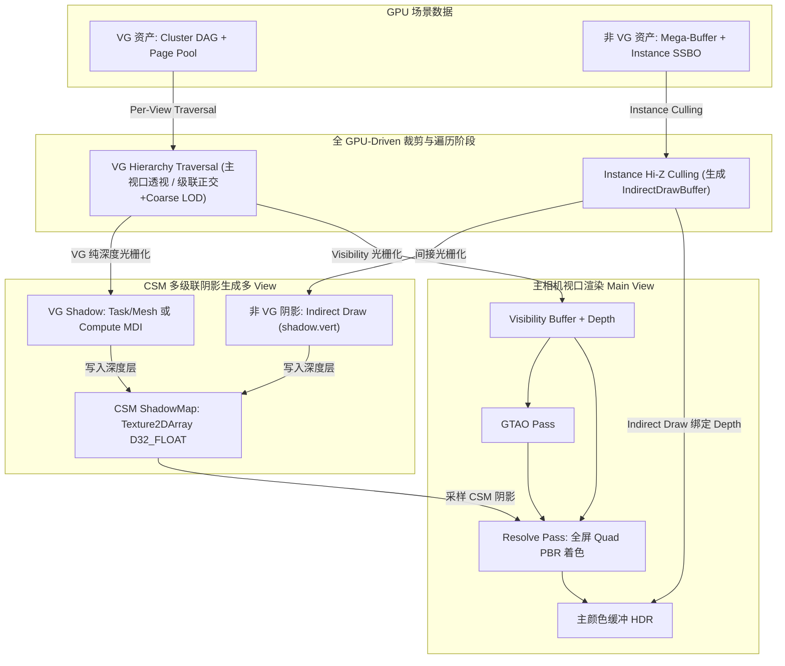
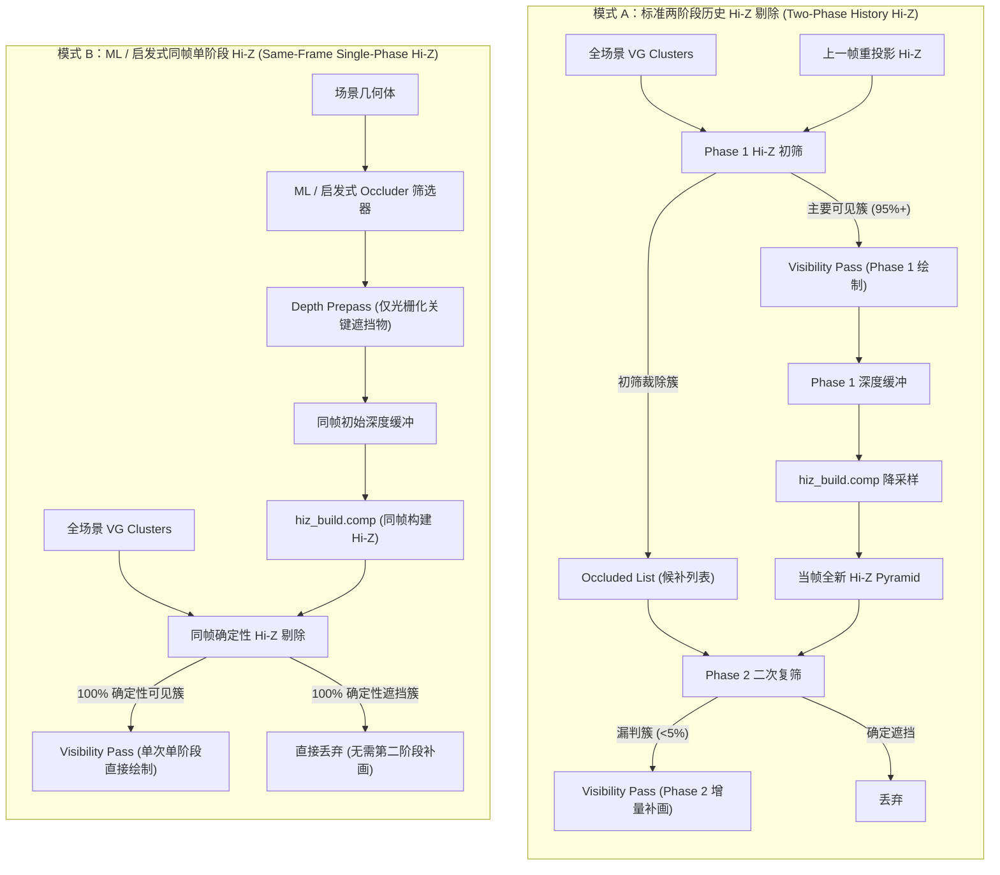

# 全 GPU-Driven 统一多 View 渲染与遮挡剔除演进计划

本文档记录 BudEngine 从阶段一（全 GPU-Driven 多 View VG 阴影）到阶段二（两阶段历史 Hi-Z 剔除 ＆ ML/启发式同帧单阶段 Hi-Z 剔除）以及阶段三（RenderGraph 深度多队列并发）的完整技术方案与架构设计。

---

## 一、 核心架构：100% 全 GPU-Driven 统一管线架构

BudEngine 采用完全基于 GPU-Driven 的现代化渲染管线（零 CPU 逐对象 Draw Call 提交），根据资产特性分为两条正交的 GPU-Driven 渲染通路：

1. **Virtual Geometry (VG) 通路（静态环境几何体）**：

   - **主视口 (Main View)**：`HierarchyTraversal (Compute)` -> `VisibilityPass (Task/Mesh 或 Compute MDI)` -> 写入 `VisibilityBuffer (R32G32_UINT)` 与 `DepthBuffer (D32_FLOAT)` -> `ResolvePass (PBR 光照 + CSM 阴影 + GTAO)`；
   - **阴影视口 (CSM Cascade Views)**：`Per-Cascade HierarchyTraversal`（正交投影 + 远景自适应 Coarse LOD）-> `Shadow Visibility (Task/Mesh 或 Compute MDI)` -> 硬件 Double-Rate Z 极速写入 `ShadowMap[i]`（纯深度）。
2. **非 VG / 传统网格通路（动态物体、骨骼蒙皮与半透明物体）**：

   - **主视口 (Main View)**：`Instance Hi-Z Culling (Compute)` -> 生成 `IndirectDrawBuffer` -> `Indirect Draw` 绘制动态物体与半透明 Alpha Blending；
   - **阴影视口 (CSM Cascade Views)**：`Instance Frustum/Hi-Z Culling` -> 生成阴影 `IndirectDrawBuffer` -> `Indirect Draw` 写入 `ShadowMap[i]`。

---

## 二、 阶段演进路线

| 阶段             | 目标                                                                          | 核心任务                                                                                                                                                                                                                                                                                                                                                                                                                                                                          | 状态              |
| :--------------- | :---------------------------------------------------------------------------- | :-------------------------------------------------------------------------------------------------------------------------------------------------------------------------------------------------------------------------------------------------------------------------------------------------------------------------------------------------------------------------------------------------------------------------------------------------------------------------------- | :---------------- |
| **阶段一** | **全 GPU-Driven 多 View VG 阴影管线**                                   | 1. 静态 VG 纯深度 Task/Mesh 着色器与正交 Traversal2. `CSMShadowPass` 融合 VG 极速光栅化与非 VG 间接绘制3. 级联 Coarse LOD 策略实装与彻底移除静态 Cache 冗余                                                                                                                                                                                                                                                                                                                     | 已完成            |
| **阶段二** | **两阶段 Cluster Hi-Z 遮挡剔除 ＆ ML/启发式同帧遮挡物增强（双轨并存）** | 1.**两阶段历史 Hi-Z 剔除（模式 A）**：Phase 1 绘制 95%+ 主要可见簇 -> Hi-Z 生成 -> Phase 2 增量补画 <5% 漏判簇2. **ML/启发式同帧单阶段 Hi-Z（模式 B）**：保留 `DepthPass` 架构，利用 ML 挑选关键大型 Occluder 快速预光栅化构建同帧 100% 确定性 Hi-Z，实现单阶段一次性绘制（免除第二阶段补画）                                                                                                                                                                       | 进阶规划 / 待实施 |
| **阶段三** | **RenderGraph 深度多队列（Multi-Queue）架构优化**                       | 1.**独立 Transfer/Copy Queue**：VG Page 流式加载全面走硬件 DMA Copy Engine，实现 0 SM 争抢与 0 掉帧流式传输2. **Async Compute Queue 并发重叠**：将 CSM/主视口 Hierarchy Traversal 与 Ambient Occlusion (AO) 计算通道分派至独立 Compute 队列，与 CSM 纯深度光栅化/主通道实现 ALU 与 ROP 的 100% 硬件并发重叠（预计压降 2~4ms 帧时间）3. **跨队列资源所有权转移与 Timeline Semaphore**：RenderGraph 自动化跨队列 Release/Acquire 屏障与纳秒级硬件时间线信号量同步 | 进阶规划          |

---

## 三、 阶段二详细架构：遮挡剔除双模式体系

阶段二中，两阶段历史 Hi-Z 与 ML/启发式同帧 Hi-Z 共同构成完整的遮挡剔除双轨架构：

### 3.1 模式 A：两阶段历史 Hi-Z 剔除（Two-Phase Culling，核心基石）

- **适用场景**：无专用 ML / 启发式遮挡物预选时的通用遮挡剔除；
- **工作流**：
  1. **Phase 1**：基于上一帧重投影的 Hi-Z 进行初筛，光栅化 95%+ 主要可见簇，生成当帧基础深度；
  2. **Hi-Z 构建**：基于 Phase 1 深度立即构建当帧完整 Hi-Z Pyramid；
  3. **Phase 2**：对初筛候补列表针对新 Hi-Z 进行二次复筛，仅补画因相机快速运动漏判的簇（<5%），保证画面 100% 视觉正确。

### 3.2 模式 B：ML / 启发式同帧单阶段 Hi-Z 剔除（Same-Frame Single-Phase，进阶形态）

- **核心优势**：**彻底免除第二阶段（Phase 2）增量补画与候补列表管理！**
- **工作流**：
  1. **ML / 启发式预筛选**：利用 ML / 规则模型在 CPU/GPU 极速挑选场景中最具遮挡价值的少量大型 Occluder（地表、主要建筑主体、巨型岩石等）；
  2. **同帧 Depth Prepass**：利用保留的 `bud.pass.depth.cpp` 快速光栅化这些 Occluder，直接构建出**当帧实时 100% 准确的同帧初始 Hi-Z**；
  3. **单阶段终极剔除与绘制**：全场景所有 VG Clusters 直接针对此同帧 Hi-Z 做确定性剔除，一次性分派 `Visibility Pass` 完成绘制，**完全不需要 Phase 2 二次复筛与增量补画**。

---

## 四、 阶段三详细架构：RenderGraph 多队列与硬件并发（Multi-Queue Architecture）

```mermaid
gantt
    title 多队列并发调度时序与硬件重叠 (Multi-Queue Overlapping Timeline)
    dateFormat X
    axisFormat %s

    section Graphics Queue (Raster/ROP)
    CSM Shadow Pass (纯深度光栅化)   :active, g1, 0, 35
    Visibility Pass (Task/Mesh 光栅化) :active, g2, 35, 95
    Resolve Pass (PBR 光照合成)      :active, g3, 115, 145

    section Async Compute Queue (ALU)
    CSM Cascade 0~3 Traversal (Compute) :crit, c1, 0, 25
    Main View Traversal (Compute)       :crit, c2, 25, 55
    Ambient Occlusion GTAO (Compute)    :crit, c3, 55, 105
    AO Blur Pass (Compute)              :crit, c4, 105, 115

    section Transfer Queue (DMA Engine)
    VG Page Staging -> GPU VRAM 拷贝   :done, t1, 0, 140
```

1. **RHI 多队列抽象与生命周期管理**：

   - 探测并创建 `graphics_queue`、`async_compute_queue`、`dedicated_transfer_queue`；
   - 为每个 Queue 家族独立分配 `VkCommandPool` 与环形 Command Buffer 池。
2. **RenderGraph 跨队列调度与所有权转移（Ownership Transfer）**：

   - RenderGraph 编译阶段自动识别 Pass 的 `QueueType`（Graphics / Compute / Transfer）；
   - 当资源在跨 Queue 依赖时（如 Compute 产出的 `visible_pages` 传递给 Graphics `VisibilityPass`），自动在源队列插入 `Release Barrier`，在目标队列插入 `Acquire Barrier`。
3. **GPU 时间线信号量（Timeline Semaphore）同步**：

   - 彻底避免 CPU 同步等待，使用 `VkSemaphoreSubmitInfo` 基于单调递增的 `uint64_t` 时间线值在 GPU 硬件底层实现极低开销的跨队列互锁。
