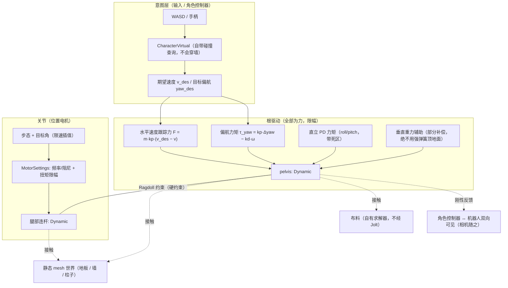

# Unitree G1 机器人：由正向运动学驱动改为纯物理驱动 演进计划

本文档记录把 G1 机器人从「脚本直接设定位姿（正向运动学 / Forward Kinematics）」改为「纯物理驱动（受力与关节电机）」的完整方案。目标是让物理场景**严格受物理引擎约束**：不再有位姿预设、不再由脚本把刚体塞进碰撞网格，机器人与静态几何、布料、角色之间的关系全部由求解器决定。

---

## 一、 背景与问题

### 1.1 现状做法

当前 `RobotAvatarController::update()` 每帧执行：

1. 读取角色控制器（CharacterVirtual）的位置与朝向，用地面射线得到 `ground_y`；
2. 直接把 pelvis 高度设为 `ground_y - sole_offset`（硬吸附，脚底与地面齐平）；
3. 通过 `BodyInterface::MoveKinematic(pelvis_bid, target, rotation, dt)` **把根连杆（Kinematic）瞬移到该位姿**；
4. 关节由位置电机驱动步态目标角。

### 1.2 为什么这是错的

- `MoveKinematic` 是**直接指定运动学位姿（数学）**，不是物理：它的语义是「把运动学体移到目标并推开挡路的动态体」，**它自己不会被静态几何阻止**。脚本让脚底与地面齐平，等于命令引擎把一个凸包放进三角网格里。
- 由此产生的**深穿透**会走 Jolt 最脆弱的一条窄相路径（convex vs mesh 的 EPA），并在 Release 下触发 Jolt 的定长池越界写（详见 1.3），最终表现为随机崩溃。
- 早期为了止崩，采用「动态体不与静态体配对」的规避手段，等价于**放弃机器人与世界的物理交互**——这违背了「用物理引擎模拟物理世界」的初衷。

### 1.3 责任划分（已实证）

| 项 | 归属 | 说明 |
| :--- | :--- | :--- |
| 把运动学体移入静态几何 | 使用方责任 | 官方文档要求：kinematic/teleport 的目标位姿必须无碰撞，由调用者保证 |
| 位置电机目标受阻时持续施压 | 使用方责任 | 需自行限幅目标与扭矩 |
| 刚体深穿透 mesh | 使用方责任 | 官方文档明确要求避免 |
| Release 下 EPA 定长池越界写 | Jolt 缺陷 | `EPAPenetrationDepth::SupportPoints::Add` 的 `mP/mQ` 裸写、`StaticArray::push_back` 仅断言保护；核对上游 master 至今未修 |

结论：**必须改为物理驱动**（本计划），Jolt 的健壮性缺陷另行上报，不作为规避方案的借口。

---

## 二、 目标与原则

1. **无位姿预设**：删除所有 `MoveKinematic` / `SetPositionAndRotation` 形式的机器人驱动；
2. **受力驱动**：根连杆改为 Dynamic，用「速度跟踪力 + 直立 PD 力矩 + 偏航力矩 + 轻度重力辅助」驱动，**所有力限幅**；
3. **关节仍用位置电机**：保持站姿与步态，但用频率/阻尼表述并限幅扭矩、目标角限速插值；
4. **碰撞全开**：机器人连杆与静态 mesh、角色、其他动态体全部真实碰撞（`动态 × 静态` 配对恢复）；
5. **接触即不可穿透**：因为全部是力/约束，接触约束必然胜出，脚本无法再把体压入几何；
6. **不改动**：渲染、布料（自有 GPU XPBD 求解器）、玩家 `CharacterVirtual` 的碰撞查询与相机绑定逻辑。

---

## 三、 目标架构

要点：

- **根连杆 Dynamic**：`RagdollSettings::mParts[i].mMotionType = Dynamic`（当前 pelvis 为 Kinematic）；
- **根驱动 = 力**：水平速度跟踪（低增益、限幅）+ 偏航力矩 + 直立 PD（带死区）+ 垂直方向**只做部分重力补偿**；
- **关节 = 位置电机**：`MotorSettings` 用 `mSpringFrequency` / `mSpringDamping`（临界阻尼）表述，扭矩限幅；步态目标角限速插值；
- **接触优先**：任何力都无法把体压穿静态几何——这正是我们要的「物理世界严格受物理引擎约束」。

---

## 四、 实施阶段

| 阶段 | 目标 | 核心任务 | 状态 |
| :--- | :--- | :--- | :--- |
| **阶段一** | **解耦：去掉一切位姿预设** | 1. loader 中根连杆 `Kinematic → Dynamic`2. 删除 `MoveKinematic` 与 `ground_y − sole_offset` 硬吸附写入3. `m_current_pelvis_pos` 改为**读取物理真实位姿**（相机/FK/可视化沿用）4. 确认每连杆 mass / inertia 为正且量级合理 | 待实施 |
| **阶段二** | **站立：稳定不抖不塌** | 1. 关节电机改频率/阻尼表述（10~25 Hz，阻尼 ≈ 1.0）2. `PhysicsSettings::mNumPositionSteps` 2 → 3~5 3. 每 body 加线性/角阻尼（0.05~0.2）4. 垂直仅做部分重力补偿5. 直立 PD（小增益 + 死区 ±3°）6. 跌倒检测 → 复位 idle（兜底） | 待实施 |
| **阶段三** | **行走：力驱动位移** | 1. 水平速度跟踪力（低增益、限幅）替代位姿跟随2. 偏航力矩追踪目标朝向3. 步态目标角限速插值（`dt·8~10`）4. 速度 0.3 → 1.0 m/s 逐步验证 | 待实施 |
| **阶段四** | **碰撞正确性** | 1. `kDisableDynamicVsStatic = false`（动态 × 静态配对全开）2. 长走 60s（平地 / 台阶 / 贴墙 / 转身）不崩，机器人被墙与柱子真实阻挡3. 若仍偶发深穿透崩溃 → 可选启用本地 Jolt 池守卫补丁作为保险，并同步上报上游 | 待实施 |
| **阶段五** | **观感与收尾** | 1. 参数暴露到 UI（速度、刚度、阻尼、直立增益）2. 物理耗时可观测（HUD/日志）3. 与角色控制器的双向关系整理（相机、接触推力）4. 清理排查期遗留的临时注释与开关 | 待实施 |

---

## 五、 稳定性参数建议

| 目的 | 旋钮 | 建议值 |
| :--- | :--- | :--- |
| 关节不松不抖 | `MotorSettings::mSpringFrequency` / `mSpringDamping` | 10~25 Hz / 1.0（临界阻尼） |
| 约束更刚性 | `PhysicsSettings::mNumPositionSteps` / `mNumVelocitySteps` | 3~5 / 10 |
| 抑制高频抖动 | `BodyCreationSettings::mLinearDamping` / `mAngularDamping` | 0.05~0.2 |
| 接触稳定 | `PhysicsSettings::mBaumgarte` / `mPenetrationSlop` | 0.1~0.2 / 0.02 |
| 数值稳定 | 固定时间步 + `collision_steps` | 1/60 或 1/120，collision steps 2~4 |
| 质量比 | 相邻连杆质量比 | < 10 : 1 |
| 根驱动 | 水平速度跟踪增益 / 限幅；垂直重力补偿比例 | 低增益；补偿 50%~90%，不上强弹簧 |

---

## 六、 验收标准

1. **不崩溃**：Profile 与 Debug 在平地 / 台阶 / 贴墙 / 转身各 60 秒行走均不崩；
2. **物理正确**：机器人被墙、柱子、道具真实阻挡；不会穿模；脚底不被压入地板；
3. **稳定站立**：静止时关节不下垂、无可见抖动；被推动后能自行恢复站姿；
4. **行走可用**：0.3 → 1.0 m/s 平稳推进，目标朝向可控；
5. **无回归**：布料、玩家移动、相机、渲染行为与改动前一致（布料本就与 Jolt 无关）；
6. **可回退**：每一阶段独立可回退，不出现「改到一半不可用」的中间态。

---

## 七、 风险与回退

| 风险 | 影响 | 应对 |
| :--- | :--- | :--- |
| 平衡难以稳定（动态根的固有问题） | 站不稳 / 抖动 | 按阶段二逐项加阻尼与直立辅助；必要时提高位置电机频率与 `mNumPositionSteps` |
| URDF 质量/惯性不合理 | 数值发散（视觉上像“炸开”） | 阶段一即校验并修正，必要时按几何估算惯性 |
| 台阶/门槛处仍出现深穿透 | 触发 Jolt 缺陷 | 局部简化碰撞（台阶用 Box 代理）或启用 Jolt 池守卫补丁 |
| 物理耗时上升 | 帧时间增加 | 限制激活连杆数、按需开启/关闭电机、观测物理耗时 |

回退策略：每阶段结束提交一次可运行状态；若某阶段不达标，仅回退该阶段改动，不影响其它系统。

---

## 八、 明确不做的事

- 不使用「运动学 pelvis + 位姿预设」的任何形式的机器人驱动；
- 不通过**关闭动态 × 静态配对**来规避崩溃（本轮已恢复为全开）；
- 不改动渲染、布料求解器、玩家 `CharacterVirtual` 的碰撞与相机绑定逻辑；
- 不用 Box/Plane 替换场景的 mesh 碰撞（场景静态几何保持 MeshShape，符合官方要求）。
